# Changelog

## 0.23.1

### Fixes

- Update the new "Create Pull Request" icon to be a sharper image.

## 0.23.0

### Changes

- Creating a pull request now uses views in the activity bar. You can enter the details of the pull request and view the diff between
the current branch and the base branch.
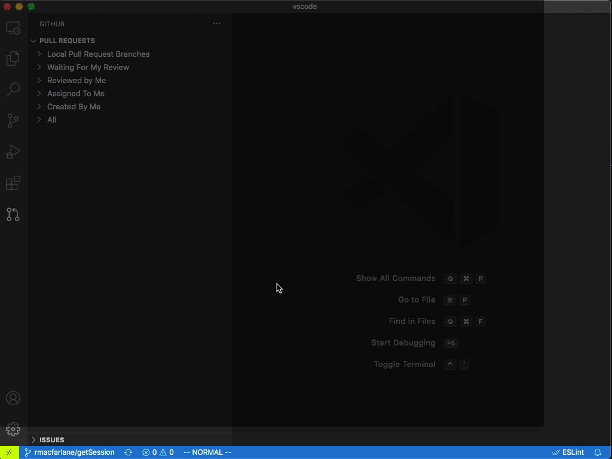

- When you publish a branch using the terminal, clicking on the resulting link can also be used to start the create pull request flow.

- The command to create a pull request now also appears in the SCM view.

- Add a command to copy a GitHub permalink as markdown.
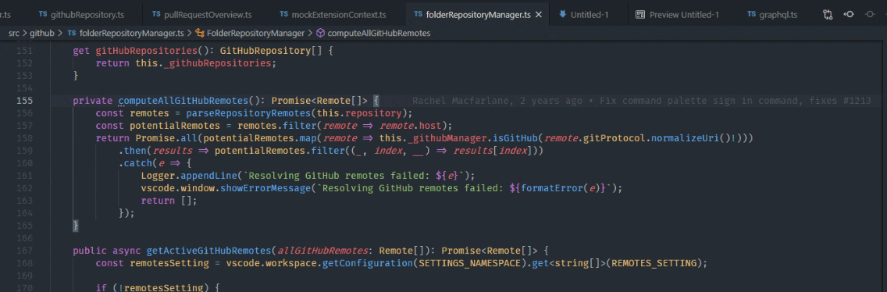

### Fixes

- Thanks to @IllusionMH, timestamps in the commit list do not text wrap.

## 0.22.0

### Changes

- Colored icons are used in the issues view. 
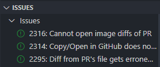

- File changes in the Pull Request view are expanded by default.

- The timestamp in the pull request description has hover with the exact time.
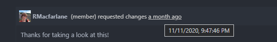

- There's a new command to "Leave Review Mode". It checks-out the default branch for the repository and remove the comment UI, just like the "Leave Review mode" button in the pull request description.

- The "Description" node in the Pull Request tree has an inline action to checkout the pull request.

- The Pull Request view lists the PR number first in the title, and also moves the "Draft" indication to be more prominent.
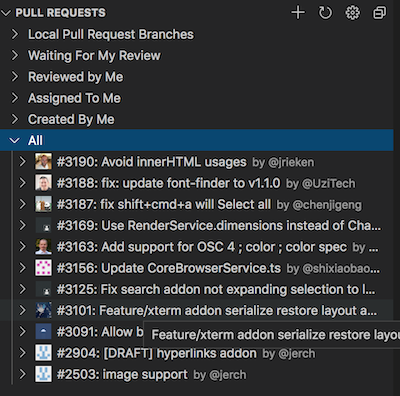

- Thanks to @ejkim1996, there is an action to toggle between viewing files in a tree structure and viewing them as a flat list in the Changes in Pull Request view. 
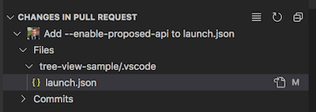

- When a pull request is checked out, opening a file associated with it will automatically reveal this it in the CHanges in Pull Request view.

### Notable fixes

- Clicking on a comment link on the pull request description page now always opens the associated file.

- Thanks to @KaiSforza, the `The remote <remoteName> is not a GitHub repository.` error is now surpressed for remotes outside of those set in `githubPullRequests.remotes`.

## 0.21.4
- Adopt latest API changes for TreeItem in VS Code 1.52.0

## 0.21.3
- Adopt latest API changes for VS Code 1.52.0.

## 0.21.2

- Revert previous changes for proposed API changes since the minimum engine version is currently set to 1.50.0.

## 0.21.1

- Adopt latest proposed API changes.
## 0.21.0

### Changes

- GitHub permalinks in issue hovers for files that exist in your current workspace will be opened locally.
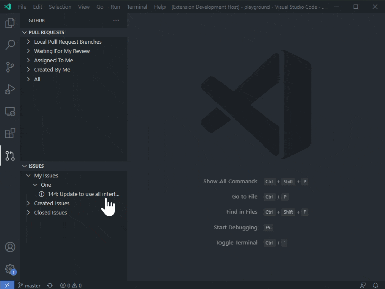

- We are trying out a new "focused review" mode which changes the layout when you checkout a PR. You can try it with the `githubPullRequests.focusedMode` setting.
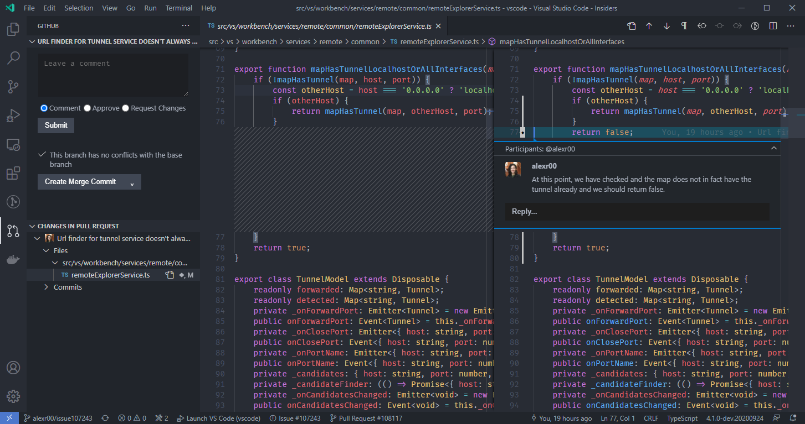

- Issue suggestions are now shown in code comment editors.

- When you Start Working on an issue, it will be assigned to you if you permissions in the repository allow it.

- Thanks to @rishab-pdx, the description page of the pull request now has an action to copy the link to the PR.

### Notable fixes

- Instead of showing two login buttons (one each in the Pull Requests and Issues views), we now show a login view.

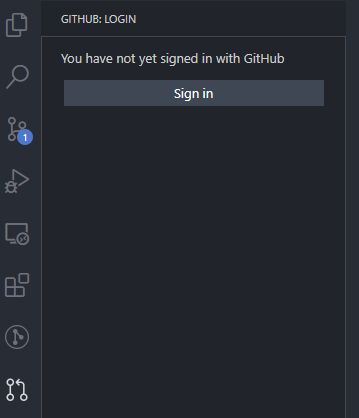

- Editor tab titles are now shortened to the file name when viewing diffs from a pull request, and are suffixed with `(Pull Request)`.

## 0.20.1

- Fixes loading the extension in VSCode Insider's 1.50

## 0.20.0

### Changes

- Pull requests and issues now follows a multi-repo model. This means that if you have folders in your workspace from different repositories you'll see the issues and pull requests from the repositories at the same time. You can also have pull requests checked out from multiple repositories.

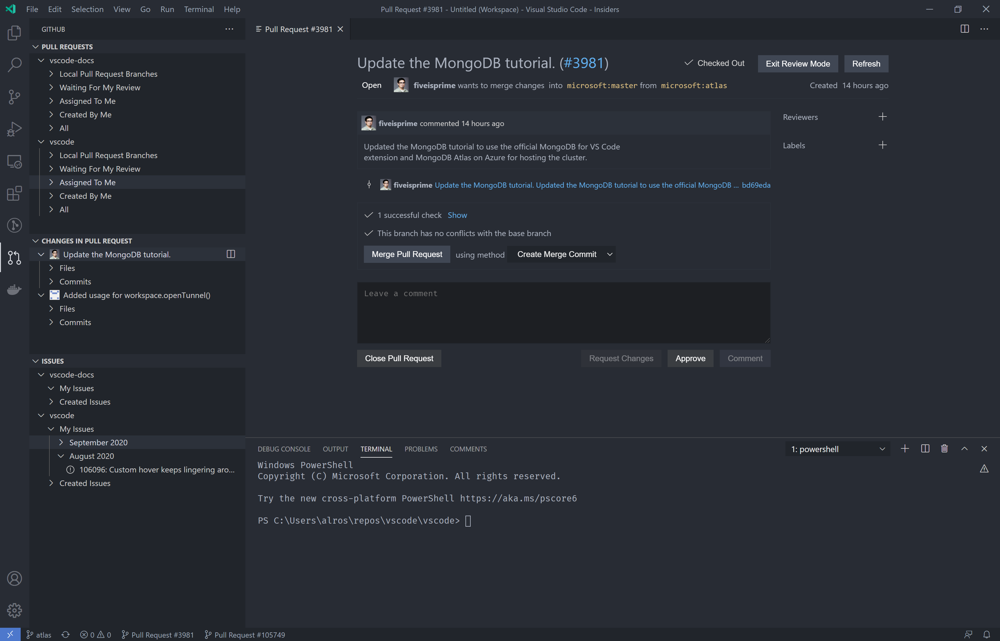

- There is new setting, `githubPullRequests.pullRequestDescription`, to control how the description is set when creating a pull request. By default, this uses the pull request template in the repository if it exists, but can also be changed to use the latest commit message, a custom message input at create time, or to ask which of these options to use. Thank you to @heaths for this feature!

### Notable fixes
- GitHub Action based status checks are now rendered on the description page.
- Commenting on stale pull requests is better handled.

## 0.19.0

### Changes

- When you try to **Start Working on Issue** in a repository where you don't have permission to push, you now have the option to fork the repository. This flow will fork the repository and configure your remotes.

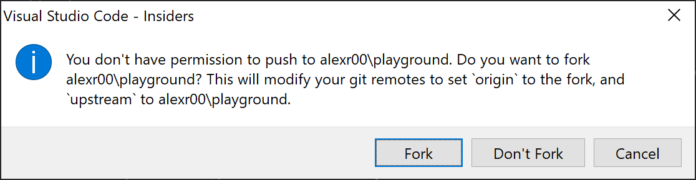

- When attempting to push changes to a repository that you do not have permissions to push to, the extension will now prompt you to fork the repository and push to that instead.

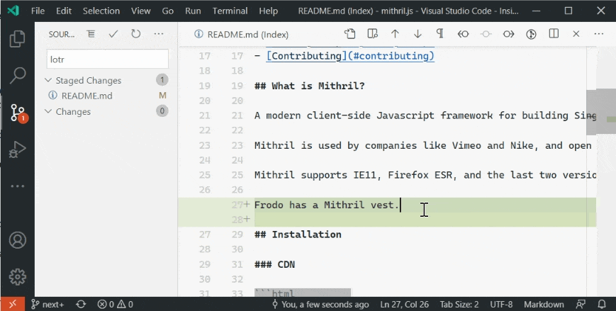

- Updated the version of @octokit/rest to ^18.0.0. This is was a big refactor, but should result in better performance.

### Notable fixes

- The setting `githubIssues.workingIssueBranch` is deprecated in favor of the better named `githubIssues.issueBranchTitle`.
- The `githubIssues.issueBranchTitle` setting is now validated.

## 0.18.1

### Changes

- Adopt latest authentication provider API changes

## 0.18.0

### Changes

- The Issues view now shows the markdown card on hover.

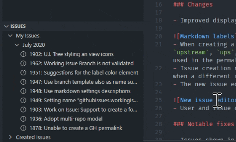
- Label suggestions are provided in the new issue editor.

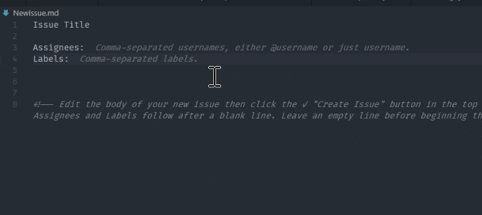
- Hovers work for issues formatted as GH-123.
- The `githubIssues.issueBranchTitle` setting can take the new variable `${sanitizedIssueTitle}`.
- If you have uncommitted changes in your issue branch when you try to create a pull request, you'll be prompted to commit them.

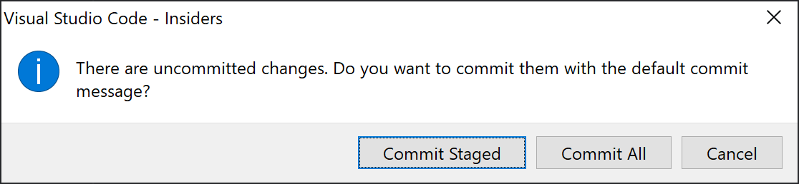
- Closed issues in the Issues view use the closed icon.
- The Pull Requests and Issues views use the visually appealing welcome mechanism to display the Sign in button.

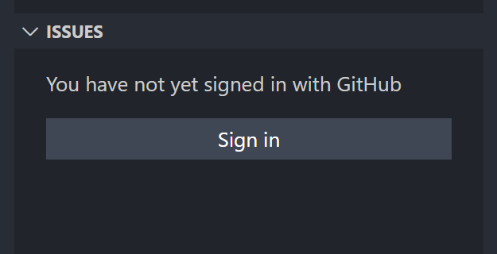

### Notable fixes

- Users are only fetched when needed, not on every startup ([1869](https://github.com/microsoft/vscode-pull-request-github/issues/1869))
- For hovers, the max issue number for the repo is checked to reduce false positives([1860](https://github.com/microsoft/vscode-pull-request-github/issues/1860))

## 0.17.0

### Changes

- Improved display of labels in issue hovers by swapping out the existing svg version of the labels for a newly supported html version.

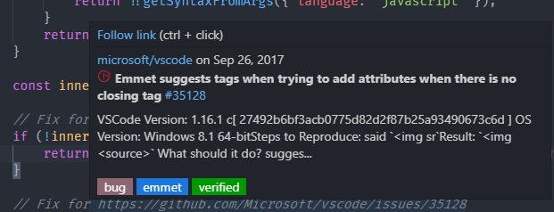
- When creating a GitHub permalink, we now try to pick the "best" remote if the currently opened repository has several remotes. The priority of remote is `upstream`, `ups`, `origin`, then other names. The first remote from that ordering which contains the same commit that the current branch is on will be used in the permalink.
- Issue creation now better takes into account the file that you're coming from when you create an issue instead of only listening for repository change when a different repository is selected in the SCM view.
- The new issue editor now lets you edit the title, assignees, labels, and description.

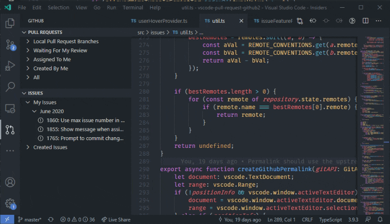
- User and issue completions now only show in plaintext and in comments! No more noisy issue suggestions when you trigger suggest in code.

### Notable fixes

- Issues shown in the completion suggestion are now deduped, even when the `githubIssues.queries` result in having the same issue twice ([1800](https://github.com/microsoft/vscode-pull-request-github/issues/1800)).
- There is not longer a notification shown when running **GitHub Issues: Copy GitHub Permalink** ([1787](https://github.com/microsoft/vscode-pull-request-github/issues/1787)).
- Comments are removed when showing issue hovers ([1763](https://github.com/microsoft/vscode-pull-request-github/issues/1763)).
- The Issues view now has a loading state that matches the Pull Requests view.
- Better support in multiroot workspaces ([1741](https://github.com/microsoft/vscode-pull-request-github/issues/1741)).

## 0.16.0

We have been working on a new set of GitHub issue related features. Take a look at our [documentation](https://github.com/microsoft/vscode-pull-request-github/blob/master/documentation/IssueFeatures.md) for more details on these and how to use them!

### Changes
- New issues view that supports custom queries
- User and issue completions in editors, which can be configured per language or disabled
- Hover for issues and users in the editor
- Issue completions within the commit input box in the SCM viewlet
- "Start working on issue" action which automatically create a branch, seed the commit message [1546](https://github.com/microsoft/vscode-pull-request-github/issues/1546)
- Create pull request from current issue
- Adopt new VSCode Authentication Provider API [1616](https://github.com/microsoft/vscode-pull-request-github/issues/1616)
- Change activity bar icon to pull request icon [1617](https://github.com/microsoft/vscode-pull-request-github/issues/1617)
- Add a button to fetch when viewing partial content [1462](https://github.com/microsoft/vscode-pull-request-github/issues/1462) by @RikkiGibson
- Support mentionable users in LiveShare extension 'suggested' contacts [1694](https://github.com/microsoft/vscode-pull-request-github/issues/1694)
- Contribute a GitHub repository picker to the `Git: Clone` command [1547](https://github.com/microsoft/vscode-pull-request-github/issues/1547)
- Create a GitHub repository from a git workspace [1664](https://github.com/microsoft/vscode-pull-request-github/issues/1664)
- Update dependencies

### Bug fixes
- Remove nonstandard anyways [1602](https://github.com/microsoft/vscode-pull-request-github/pull/1602) by @curtisgibby

## 0.15.0

### Bug fixes
- Update remotes setting description [1478](https://github.com/microsoft/vscode-pull-request-github/issues/1478)
- Fix display of review comment summary on description page [1486](https://github.com/microsoft/vscode-pull-request-github/issues/1486)
- Fix creation of PRs when source branch is not listed in remotes setting [1326](https://github.com/microsoft/vscode-pull-request-github/issues/1326)
- Improve remote selection wording [866](https://github.com/microsoft/vscode-pull-request-github/issues/866)
- Reorder comment reaction menu to match GitHub [1532](https://github.com/microsoft/vscode-pull-request-github/issues/1532)
- Do not duplicate comments on tree refresh [1492](https://github.com/microsoft/vscode-pull-request-github/issues/1492)

## 0.14.0

### Changes
- Remove branching logic for graphql [1431](https://github.com/microsoft/vscode-pull-request-github/issues/1431)

### Bug fixes
- Set 'authServer' query parameter when opening login url [1440](https://github.com/microsoft/vscode-pull-request-github/issues/1440)
- Prevent reflow of PR title on hover [1450](https://github.com/microsoft/vscode-pull-request-github/issues/1450)
- Show rendered markdown after editing on description page [1457](https://github.com/microsoft/vscode-pull-request-github/issues/1457)
- Better error handling for deleting local branches [1465](https://github.com/microsoft/vscode-pull-request-github/issues/1465)
- Migrate to asExternalUri API [1475](https://github.com/microsoft/vscode-pull-request-github/issues/1475)

## 0.13.0

We saw a huge amount of community participation this release, thank you so much to everyone who contributed!

### Changes
- Option to view changed files in a tree instead of a list [653](https://github.com/microsoft/vscode-pull-request-github/issues/653) by @yulrizka
- Allow choosing title when creating pull request [906](https://github.com/microsoft/vscode-pull-request-github/issues/906) by @nminchow
- Add context menu actions to open original/modified file [35](https://github.com/microsoft/vscode-pull-request-github/issues/35) by @anoadragon453 and @Tunous
- Add pending label to comments of pending reviews on timeline [1369](https://github.com/microsoft/vscode-pull-request-github/issues/1369) by @akosasante
- Support images in tree diff views [1356](https://github.com/microsoft/vscode-pull-request-github/issues/1356)
- When file change patch is empty, directly fetch the file contents instead of showing notification to open on GitHub [305](https://github.com/microsoft/vscode-pull-request-github/issues/305)
- Add a quote reply action for comments on the description page [1396](https://github.com/microsoft/vscode-pull-request-github/issues/1396) by @shaodahong
- Clicking status bar item brings up configuration actions [360](https://github.com/microsoft/vscode-pull-request-github/issues/360)

### Bug fixes
- Sign-out picker: do not close on focus lost [1348](https://github.com/microsoft/vscode-pull-request-github/issues/1348)
- Align "Request Changes" and "Approve" by comment [297](https://github.com/microsoft/vscode-pull-request-github/issues/297) by @guilherme-gm
- Align commit hash in PR description and avoid breaking username on hyphen [1353](https://github.com/microsoft/vscode-pull-request-github/issues/1353) by @JeffreyCA
- Show "Successfully signed in" in status bar after login instead of notification [1347](https://github.com/microsoft/vscode-pull-request-github/issues/1347) by @JeffreyCA
- Check status bar item exists before setting text [1251](https://github.com/microsoft/vscode-pull-request-github/issues/1251)
- Add confirmation dialog to delete review [1364](https://github.com/microsoft/vscode-pull-request-github/issues/1364)
- Address @octokit/rest deprecation warnings [1367](https://github.com/microsoft/vscode-pull-request-github/issues/1367)
- Correctly handle undefined path for empty files [1372](https://github.com/microsoft/vscode-pull-request-github/issues/1372)
- Fetch branch prior to checking if its behind remote [1368](https://github.com/microsoft/vscode-pull-request-github/issues/1368)
- Use path relative to the git repo instead of workspace [1374](https://github.com/microsoft/vscode-pull-request-github/issues/1374)
- Editing comment on description page does not immediately update text [1383](https://github.com/microsoft/vscode-pull-request-github/issues/1383)
- Cancel edit reverts to the wrong value of comment when re-editing [1157](https://github.com/microsoft/vscode-pull-request-github/issues/1157)
- Fix commenting ranges for deleted files [1384](https://github.com/microsoft/vscode-pull-request-github/issues/1384)
- Fix description page styling when reloading on high contrast theme [897](https://github.com/microsoft/vscode-pull-request-github/issues/897)
- Make comment drag handle transparent [1361](https://github.com/microsoft/vscode-pull-request-github/issues/1361) by @JeffreyCA
- Fix failure to detect remote is github when it has www subdomain [903](https://github.com/microsoft/vscode-pull-request-github/issues/903)
- Prevent Checkout/Refresh being selected on description page [628](https://github.com/microsoft/vscode-pull-request-github/issues/628)
- Prevent double selection when using secondary actions in the tree [1270](https://github.com/microsoft/vscode-pull-request-github/issues/1270)
- Preserve expansion state of tree view items on checkout [1392](https://github.com/microsoft/vscode-pull-request-github/issues/1392)
- Fix TypeError "Cannot read property 'comments' of undefined" while loading description page [1307](https://github.com/microsoft/vscode-pull-request-github/issues/1307)
- Prevent links from overflowing the description area [806](https://github.com/microsoft/vscode-pull-request-github/issues/806) by @lifez
- Ensure tree decorations are updated as comments change [664](https://github.com/microsoft/vscode-pull-request-github/issues/664)
- Support permanently ignoring sign in notification [1389](https://github.com/microsoft/vscode-pull-request-github/issues/1389)
- Show PR actions only to users with push access [967](https://github.com/microsoft/vscode-pull-request-github/issues/967) by @IllusionMH
- Preserve tree state on reload [1036](https://github.com/microsoft/vscode-pull-request-github/issues/1036) and [1409](https://github.com/microsoft/vscode-pull-request-github/issues/1409)
- Use `asWebviewUri` API to get webview script URI by @IllusionMH
- Remove useless conditional in preview header by @emtei
- Fix for displaying invalid pull request messages by @emtei
- Disable selection line numbers in diffs on the description page [354](https://github.com/microsoft/vscode-pull-request-github/issues/354)
- Better support for merging when in dirty state [1405](https://github.com/microsoft/vscode-pull-request-github/issues/1405)
- Explain self assignment in pullRequestNode [1421](https://github.com/microsoft/vscode-pull-request-github/issues/1421) by @emtei
- Add back "Outdated" label to comments on description page [1407](https://github.com/microsoft/vscode-pull-request-github/issues/1407)
- Fix invalid graphql url for github enterprise [1381](https://github.com/microsoft/vscode-pull-request-github/issues/1381) by @yulrizka
- Display "pending" mergeability state on description page and poll for updates [1412](https://github.com/microsoft/vscode-pull-request-github/issues/1412)
- When assigning reviewers, limit list to assignable users and improve ordering [1424](https://github.com/microsoft/vscode-pull-request-github/issues/1424) by @IllusionMH
- Improve visibility of PR controls to take into account user write permissions [1408](https://github.com/microsoft/vscode-pull-request-github/issues/1408) and [1065](https://github.com/microsoft/vscode-pull-request-github/issues/1065) by @IllusionMH

## 0.12.0

- Adopt `createAppUri` API in authentication flow [1354](https://github.com/microsoft/vscode-pull-request-github/pull/1345)

## 0.11.2

### Bug fixes
- Comments sometimes duplicated on diff files from pull request tree [#1337](https://github.com/microsoft/vscode-pull-request-github/issues/1337)

## 0.11.1

### Bug fixes
- Pull request tree incorrectly shows 'No git repositories found' [#1334](https://github.com/microsoft/vscode-pull-request-github/issues/1334)

## 0.11.0

### Changes
- Add support for deleting a PR after close or merge [#350](https://github.com/microsoft/vscode-pull-request-github/issues/350)
- Update GraphQL timeline event query
- Update dependencies

### Bug fixes
- Fix formatting of GitHub errors [#1298](https://github.com/microsoft/vscode-pull-request-github/issues/1298)
- Show error when user doesn't have permission to push to remote [#1299](https://github.com/microsoft/vscode-pull-request-github/issues/1299)
- Remove usage of rootPath and fix suggested edits [#1312](https://github.com/microsoft/vscode-pull-request-github/issues/1312)
- Disable 'Checkout' and 'Exit Review Mode' buttons while actions are in progress [#1312](https://github.com/microsoft/vscode-pull-request-github/issues/1312)
- Calculate unique branch name for PRs from forks [#1294](https://github.com/microsoft/vscode-pull-request-github/issues/1294)
- Fix 'Error: No matching file found' problem when adding comments [#1308](https://github.com/microsoft/vscode-pull-request-github/issues/1308)
- Initialize extension with repository that is currently selected in the source control view [#1330](https://github.com/microsoft/vscode-pull-request-github/issues/1330)
- Handle error on unshallow [#1328](https://github.com/microsoft/vscode-pull-request-github/issues/1328)

## 0.1## 0.0

### Changes
- Use pull request template when creating PR [#798](https://github.com/microsoft/vscode-pull-request-github/issues/798)
- Improvements to pull request tree display message when loading or not signed in (#1269)(https://github.com/microsoft/vscode-pull-request-github/issues/1269)
- Change telemetry library to application insights [#1264)(https://github.com/microsoft/vscode-pull-request-github/issues/1264)
- Update icons to match new VSCode icon style (#1261)(https://github.com/microsoft/vscode-pull-request-github/issues/1261)
- Update dependencies

### Bug fixes
- Set a default array for `githubPullRequests.remotes` [#1289](https://github.com/microsoft/vscode-pull-request-github/issues/1289)
- Fix spacing between textbox and buttons on description page [#1287](https://github.com/microsoft/vscode-pull-request-github/issues/1287)
- Fix updates to comment thread cache when creating the first comment in a thread [#1282](https://github.com/microsoft/vscode-pull-request-github/pull/1282)
- Fix updates to outdated comments (#1279)[https://github.com/microsoft/vscode-pull-request-github/issues/1279]
- Ensure comment commands are limited to GitHub Pull Request comment widgets [#1277](https://github.com/microsoft/vscode-pull-request-github/issues/1277)
- Fix error when trying to add reviewers on description page [#1181](https://github.com/microsoft/vscode-pull-request-github/issues/1181)
- Enable removing a label on description page [#1258](https://github.com/microsoft/vscode-pull-request-github/issues/1258)

***Thank You***
- Description view of PR: make whole commit line clickable [#1259](https://github.com/microsoft/vscode-pull-request-github/issues/1259) by @tobudim
- Sort description view labels case sensitively [#1008](https://github.com/microsoft/vscode-pull-request-github/issues/1008) by @haryps

## 0.9.0

### Changes
- Adopt new commenting api [#1168](https://github.com/microsoft/vscode-pull-request-github/issues/1168)
- Set tree selection on tree node when clicking on an inline action [1245](https://github.com/microsoft/vscode-pull-request-github/issues/1245)

### Bug fixes
- Command palette sign in not working [#1213](https://github.com/microsoft/vscode-pull-request-github/issues/1213)
- Limit comment areas on the base side of diff editors to deleted lines [#153](https://github.com/microsoft/vscode-pull-request-github/issues/153)
- Ensure extension activates when ssh config contains "Host *+*" [#1255](https://github.com/microsoft/vscode-pull-request-github/issues/1255)
- Update wording of sign in notification [#757](https://github.com/microsoft/vscode-pull-request-github/issues/757)
- Address @octokit/rest deprecations [#1227](https://github.com/microsoft/vscode-pull-request-github/issues/1255)

## 0.8.0

### Changes
- Add Draft PR support [#1129](https://github.com/microsoft/vscode-pull-request-github/issues/1129)
- Support specifying custom category in PR tree view  [#1106](https://github.com/microsoft/vscode-pull-request-github/issues/1106)

### Bug fixes
- Do not show commands before extension has fully activated [#1198](https://github.com/microsoft/vscode-pull-request-github/issues/1198)
- Description page is blank after ## 0.7.0 upgrade [#1175](https://github.com/microsoft/vscode-pull-request-github/issues/1175)
- Change "wants to merge" text when viewing merged PR [#1027](https://github.com/microsoft/vscode-pull-request-github/issues/1027)
- Correct text alignment in merged timeline events [#1199](https://github.com/microsoft/vscode-pull-request-github/issues/1199)
- Update UI after adding reviewers or labels [#1191](https://github.com/microsoft/vscode-pull-request-github/issues/1191)
- Update PR details after merge [#1183](https://github.com/microsoft/vscode-pull-request-github/issues/1183)
- Display a message before opening file diffs in the browser [#442](https://github.com/microsoft/vscode-pull-request-github/issues/442), thank you [@malwilley](https://github.com/malwilley)!
- Swap order of PR branch and target branch [#784](https://github.com/microsoft/vscode-pull-request-github/issues/784)

## 0.7.0

**Engineering**
- Description view is now rendered with React [#1096](https://github.com/microsoft/vscode-pull-request-github/pull/1096)
- Performance improvement
  - [Decrease time to enter review mode](https://github.com/microsoft/vscode-pull-request-github/pull/1131)

### Bug fixes
- Pull Request Tree GitHub Enterprise Avatars [#1121](https://github.com/microsoft/vscode-pull-request-github/pull/1121)
- Unable to expand PRs whose branch contains a # character [#1059](https://github.com/microsoft/vscode-pull-request-github/issues/1059)

## 0.6.1

### Bug fixes
- Fix git onDidOpenRepository eventing [#1122](https://github.com/Microsoft/vscode-pull-request-github/pull/1122)

## 0.6.0

### Changes
- Introduce new comment provider API [#972](https://github.com/Microsoft/vscode-pull-request-github/pull/972)
- Fix rendering of checkboxes on description page [#1038](https://github.com/Microsoft/vscode-pull-request-github/issues/1038)
- Fix [#1082](https://github.com/Microsoft/vscode-pull-request-github/issues/1082) to make sure commands are scoped to the correct tree
- Fix [#291](https://github.com/Microsoft/vscode-pull-request-github/issues/291) to use monospace font for code blocks on description page

## 0.5.1

### Changes
- Fix description not displaying after creating a pull request [#1041](https://github.com/Microsoft/vscode-pull-request-github/pull/1041)

## 0.5.0

**Breaking Changes**

- From 0.5.0, you at least need VSCode 1.32 to install and run the extension.

### Changes
- Add support for reacting to comments [#46](https://github.com/Microsoft/vscode-pull-request-github/issues/46)
- Display reviewers on the description page, and support adding and removing them [#412](https://github.com/Microsoft/vscode-pull-request-github/issues/412)
- Support adding and removing labels from the description page [#933](https://github.com/Microsoft/vscode-pull-request-github/issues/933)
- Fix [#936](https://github.com/Microsoft/vscode-pull-request-github/issues/936), pending review not correctly detected in "Changes in Pull Request" tree
- Fix [#929](https://github.com/Microsoft/vscode-pull-request-github/issues/929), description textarea not cleared when approving or requesting changes
- Fix [#912](https://github.com/Microsoft/vscode-pull-request-github/issues/912), approving the PR scrolls to the top of the page

**New settings**
- `githubPullRequests.showInSCM` can be used to configure where the `GitHub Pull Requests` tree is shown, either the new GitHub viewlet or
the SCM viewlet where it was before. By default, the tree is shown in the GitHub viewlet.

**Thank You**
- Disable not available merge methods [#946](https://github.com/Microsoft/vscode-pull-request-github/pull/946) by @IllusionMH
- Fix LGTM.com alerts [#948](https://github.com/Microsoft/vscode-pull-request-github/pull/948) by @samlanning

## 0.4.0

**Breaking Changes**

- From 0.4.0, you at least need VSCode 1.31 to install and run the extension.

### Changes
- Display mergeability on PR description page [#773](https://github.com/Microsoft/vscode-pull-request-github/pull/773)
- Add an inline action to open the description to the side [#310](https://github.com/Microsoft/vscode-pull-request-github/issues/310)
- Add refresh button to the description page [#771](https://github.com/Microsoft/vscode-pull-request-github/pull/771)
- Improve performance of checkout by minimally fetching data and lazily loading [#796](https://github.com/Microsoft/vscode-pull-request-github/pull/796)
- Update the styling of the description page [#763](https://github.com/Microsoft/vscode-pull-request-github/pull/763)
- Support navigating to a file from the description page [#750](https://github.com/Microsoft/vscode-pull-request-github/pull/750)
- Linkify issue references on the description page [#566](https://github.com/Microsoft/vscode-pull-request-github/issues/566)
- Show user's role (collaborator, contributor, etc.) by comments on the description [#303](https://github.com/Microsoft/vscode-pull-request-github/issues/303)
- Support starting, deleting, and finishing a complete review [#546](https://github.com/Microsoft/vscode-pull-request-github/issues/546)
- Allow selecting the merge method on the description page [#826](https://github.com/Microsoft/vscode-pull-request-github/pull/826)
- Autocompletions for usernames within editor comments [#842](https://github.com/Microsoft/vscode-pull-request-github/pull/842)

As part of this release, we have begun adopting GitHub's GraphQL API in some places to support new features and improve performance. The reviews feature and linkifying of issue references depend on the GraphQL API. This API is not available for GitHub Enterprise, so please note that these features will not be available for those projects.

**New settings**
- `githubPullRequests.remotes` can be used to configure what remotes pull requests should be displayed from. By default, the extension will look for `upstream` and `origin` remotes
by convention and fetch from these, or will fetch from any other remotes if these are not present.
- `githubPullRequests.defaultMergeMethod` specifies which merge method (`merge`, `rebase`, or `squash`) to select by default, both on the description page and when using the `Merge Pull Request` command.
This is set to `merge` by default.

**Thank You**
* Fix log output [PR #804](https://github.com/Microsoft/vscode-pull-request-github/pull/804) by @Ikuyadeu
* Update setting description to use non deprecated key [PR #916](https://github.com/Microsoft/vscode-pull-request-github/pull/916) by @mkonikov

## 0.3.2
- Honor the new `git.openDiffOnClick` setting [#753](https://github.com/Microsoft/vscode-pull-request-github/pull/753)
- Prompt to stage all changes when running the suggest changes with nothing staged [#744](https://github.com/Microsoft/vscode-pull-request-github/pull/744)
- Add an inline "Open File" action in the "Changes in Pull Request" tree and match styling of git changes [#738](https://github.com/Microsoft/vscode-pull-request-github/pull/738)
- Display the full file path using the tree item's description, matching other views [#730](https://github.com/Microsoft/vscode-pull-request-github/issues/730)
- Parse auth callback state parameter on client side instead of mkaing a request to the auth server [#715](https://github.com/Microsoft/vscode-pull-request-github/pull/715)
- Fix [#735](https://github.com/Microsoft/vscode-pull-request-github/issues/735), ensure correct head parameter is used when creating PR
- Fix [#727](https://github.com/Microsoft/vscode-pull-request-github/issues/727), make sure review state is always cleared when switching branches
- Fix [#728](https://github.com/Microsoft/vscode-pull-request-github/issues/738), keep description page data up to date when updating title and description

## 0.3.1
- Add status check information on PR description page [#713](https://github.com/Microsoft/vscode-pull-request-github/pull/713)
- Add button for creating a pull request on PR tree view [#709](https://github.com/Microsoft/vscode-pull-request-github/pull/709)
- Add "Suggest Edit" command [#688](https://github.com/Microsoft/vscode-pull-request-github/pull/688)
- Fix [#689](https://github.com/Microsoft/vscode-pull-request-github/issues/689), by [@JefferyCA], do not render markdown block comments
- Fix [#553](https://github.com/Microsoft/vscode-pull-request-github/issues/553), don't prevent checkout when there are unrelated working tree changes
- Fix [#576](https://github.com/Microsoft/vscode-pull-request-github/issues/576), handle GitHub enterprise behind a SSO wall

## 0.3.0

**Breaking Changes**

- From 0.3.0, you at least need VSCode 1.30 (including Insiders) to install and run the extension.

**Thank You**

* [Jeffrey (@JeffreyCA)](https://github.com/JeffreyCA)
  * Correct timestamp format [PR #686](https://github.com/Microsoft/vscode-pull-request-github/pull/686)
  * Render Markdown line breaks as   [PR #679](https://github.com/Microsoft/vscode-pull-request-github/pull/679)
  * Support absolute and relative timestamps [PR #644](https://github.com/Microsoft/vscode-pull-request-github/pull/644)

## 0.2.3
- Fix [#607], read `~/.ssh/config` to resolve hosts
- Fix [#572], by [@yoh1496], add support for GitHub Enterprise behind a proxy
- Fix [#658], ensure correct button enablement when reloading pending comment from cache
- Fix [#649], make sure selecting a different folder is responsive after adding it to the workspace

## 0.2.2

- Add support for editing and deleting comments [#107](https://github.com/Microsoft/vscode-pull-request-github/issues/107)
- Fix [#110](https://github.com/Microsoft/vscode-pull-request-github/issues/110), by [@JeffreyCA], add hyperlinks to timestamps
- Fix [#624](https://github.com/Microsoft/vscode-pull-request-github/issues/624), by [@JeffreyCA], improve comment header wording
- Fix [#568](https://github.com/Microsoft/vscode-pull-request-github/issues/568), by [@jerrymajewski], show author information in PR tooltip
- Fix [#543](https://github.com/Microsoft/vscode-pull-request-github/issues/543), by [@malwilley], preserve description page scroll position when focus changes
- Fix [#587](https://github.com/Microsoft/vscode-pull-request-github/issues/587), by [@mmanela], show correct error message for empty comment case
- Migrate hosts setting to `githubPullRequests` namespace, by [@wyze]
- Fix [#573](https://github.com/Microsoft/vscode-pull-request-github/issues/573), provide auth fallback when protocol handler fails

**Breaking Changes**

- From 0.2.0, you at least need VSCode 1.28 to install and run the extension.

**Fixes**

- Fix [#565](https://github.com/Microsoft/vscode-pull-request-github/issues/565), inline links in description page.
- Fix [#531](https://github.com/Microsoft/vscode-pull-request-github/issues/531) by [@wyze](https://github.com/wyze), state is incorrectly shown as Closed when it should be Merged
- Fix [#273](https://github.com/Microsoft/vscode-pull-request-github/issues/273), support ssh remotes.
- Fix [#537](https://github.com/Microsoft/vscode-pull-request-github/issues/537) by [@justinliew](https://github.com/justinliew), show pull request id in title.
- Fix [#491](https://github.com/Microsoft/vscode-pull-request-github/issues#491) by [@shatgupt](https://github.com/shatgupt), allow vertical resizing of comment box.
- Fix [#319](https://github.com/Microsoft/vscode-pull-request-github/issues#319), improve keyboard focus.
- Fix [#352](https://github.com/Microsoft/vscode-pull-request-github/issues/352) by [@Ikuyadeu](https://github.com/Ikuyadeu), support merging pull request
- Fix [#464](https://github.com/Microsoft/vscode-pull-request-github/issues/464) by [@wyze](https://github.com/wyze), show labels on PR description
- Fix [#562](https://github.com/Microsoft/vscode-pull-request-github/issues/562) by [@emtei](https://github.com/emtei), prevent PR creation date collision with subtitle

## 0.1.7

- Fix for native promise polyfill removal from VSCode extension host in Insiders 1.29

## 0.1.6
- Fix for [#500](https://github.com/Microsoft/vscode-pull-request-github/issues/500) and [#440](https://github.com/Microsoft/vscode-pull-request-github/issues/440), more lenient remote parsing
- Fix for [#383](https://github.com/Microsoft/vscode-pull-request-github/issues/383), move to github.com domain for the authentication server
- Fix for [#498](https://github.com/Microsoft/vscode-pull-request-github/issues/498), make sure comments gets updated on refresh event
- Fix for [#496](https://github.com/Microsoft/vscode-pull-request-github/issues/496), linkify urls on the description page
- FIx for [#507](https://github.com/Microsoft/vscode-pull-request-github/issues/507), loosen scope restrictions for older version of GitHub Enterprise

## 0.1.5
- Fix for [#449](https://github.com/Microsoft/vscode-pull-request-github/issues/449), authentication blocked when `docs-article-templates` extension is installed
- Fix for [#429](https://github.com/Microsoft/vscode-pull-request-github/issues/429), avoid unneccessary refreshes of the tree view

## 0.1.4
- Do not ship `.vscode-test/**` files

## 0.1.3
- Fix for [#382](https://github.com/Microsoft/vscode-pull-request-github/issues/382), authentication on enterprise servers without a `/rate_limit` path
- Fix for [#419](https://github.com/Microsoft/vscode-pull-request-github/issues/419), improve parsing of git remotes and show a warning if parse fails

## 0.1.2
- Fix for [#395](https://github.com/Microsoft/vscode-pull-request-github/issues/395), tree view not shown when the extension failed to parse a remote
- [#399](https://github.com/Microsoft/vscode-pull-request-github/issues/399), use `badge.foreground` color for PR status badge
- Fix for [#380](https://github.com/Microsoft/vscode-pull-request-github/issues/380), HTML content in diff on the overview was unescaped
- Fix for [#375](https://github.com/Microsoft/vscode-pull-request-github/issues/375), appropriately fetch more changed files in the tree view
