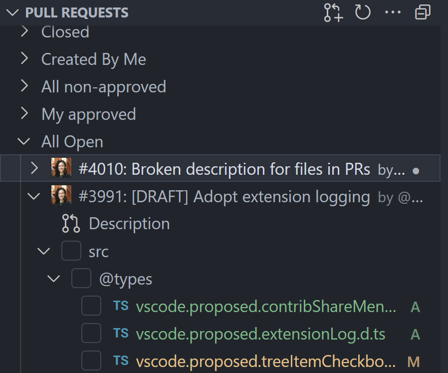

# Changelog

## 0.72.0

### Changes

- The pull request base in the "Create" view will use the upstream repo as the base if the current branch is a fork.
- There's a refresh button in the Comments view to immediately refresh comments.

### Fixes

- PR view comments should have a maximum width, with the code view using a horizontal scrollbar. https://github.com/microsoft/vscode-pull-request-github/issues/5155
- Code suggestions in PRs are hard to differentiate. https://github.com/microsoft/vscode-pull-request-github/issues/5141
- No way to remove Milestone. https://github.com/microsoft/vscode-pull-request-github/issues/5102
- Progress feedback on PR description actions. https://github.com/microsoft/vscode-pull-request-github/issues/4954

**_Thank You_**

* [@tobbbe (Tobbe)](https://github.com/tobbbe): Sanitize slashes from title [PR #5149](https://github.com/microsoft/vscode-pull-request-github/pull/5149)

## 0.70.0

### Changes

- The "Create" view has been updated to be less noisy and more useful. Aside from the purely visual changes, the following features have been added:
  - We try to guess the best possible base branch for your PR instead of always using the default branch.
  - You can add reviewers, assignees, labels, and milestones to your PR from the "Create" view.
  - By default, your last "create option" will be remembered (ex. draft or auto merge)
  - The view is much faster.
  - You can view diffs before publishing your branch.
  - Once the branch is published, you can also view commits (this is coming soon for unpublished branches).

  

- If you work on a fork of a repository, but don't ever want to know about or make PRs to the parent, you can prevent the `upstream` remote from being added with the new setting `"githubPullRequests.upstreamRemote": "never"`.

### Fixes

- Quote reply missing for some comments. https://github.com/microsoft/vscode-pull-request-github/issues/5012
- Accessibility of "suggest edits" new workflow and documentation. https://github.com/microsoft/vscode-pull-request-github/issues/4946

**_Thank You_**

* [@mgyucht (Miles Yucht)](https://github.com/mgyucht): Correctly iterate backwards through diffs across files [PR #5036](https://github.com/microsoft/vscode-pull-request-github/pull/5036)

## 0.68.1

### Fixes

- Github Enterprise Doesn't Show Comments. https://github.com/microsoft/vscode-pull-request-github/issues/4995
- Buffer is not defined when adding labels. https://github.com/microsoft/vscode-pull-request-github/issues/5009

## 0.68.0

### Changes

- Avatars in tree views and comments are circles instead of squares


- The old "Suggest Edit" command from the SCM view now directs you to "Suggest a Change" feature introduced in version 0.58.0.
- Up to 1000 (from the previous 100) comment threads can be loaded in a pull request.
- The new VS Code API proposal for a read-only message let's you check out a PR directly from an un-checked-out diff.


### Fixes

- User hover shows null when writing the @username. https://github.com/microsoft/vscode-pull-request-github/issues/4891
- Reverted PR remains visible in "Local Pull Request Branches" tab of sidebar. https://github.com/microsoft/vscode-pull-request-github/issues/4855
- Order of workspaces in multi-root workspace is not what I expect. https://github.com/microsoft/vscode-pull-request-github/issues/4837
- Reassigning same reviewers causes desync with GitHub. https://github.com/microsoft/vscode-pull-request-github/issues/4836
- Re-request review from one reviewer will remove other reviewers. https://github.com/microsoft/vscode-pull-request-github/issues/4830
- Don't reload entire DOM when getting data from GitHub. https://github.com/microsoft/vscode-pull-request-github/issues/4371

**_Thank You_**

* [@SKPG-Tech (Salvijus K.)](https://github.com/SKPG-Tech): Fix null when no user name available  [PR #4892](https://github.com/microsoft/vscode-pull-request-github/pull/4892)

## 0.66.2

### Fixes

- Use `supportHtml` for markdown that just cares about coloring spans for showing issue labels. [CVE-2023-36867](https://msrc.microsoft.com/update-guide/vulnerability/CVE-2023-36867)

## 0.66.1

### Fixes

- TypeError: Cannot read properties of undefined (reading 'number'). https://github.com/microsoft/vscode-pull-request-github/issues/4893

## 0.66.0

### Changes

- We show the same welcome view as the git extension when you open a subfolder of a git repository.


- Improved performance of extension activation, particularly for multi-repo workspaces
- There are two new actions for viewing diffs of checked out PRs: **Compare Base With Pull Request Head (readonly)** and **Compare Pull Request Head with Local**. These actions are available from the PR changes context menu.


- The new setting `"githubPullRequests.pullPullRequestBranchBeforeCheckout"` can be used to turn off pulling a previously checked out PR branch when checking out that same branch again.

### Fixes

- Bad/missing error handling when creating PR can lead to being rate limited. https://github.com/microsoft/vscode-pull-request-github/issues/4848
- My vscode workspace sometimes shows a PR from vscode-cpptools. https://github.com/microsoft/vscode-pull-request-github/issues/4842
- Improper `@mentions` in comments. https://github.com/microsoft/vscode-pull-request-github/issues/4810
- Duplicated issues in tree. https://github.com/microsoft/vscode-pull-request-github/issues/4781
- Element with id Local Pull Request Brancheshttps... is already registered. https://github.com/microsoft/vscode-pull-request-github/issues/4642

**_Thank You_**

* [@kabel (Kevin Abel)](https://github.com/kabel): Simplify `AuthProvider` enum [PR #4779](https://github.com/microsoft/vscode-pull-request-github/pull/4779)
* [@SKPG-Tech (Salvijus K.)](https://github.com/SKPG-Tech): Add missing index in template [PR #4822](https://github.com/microsoft/vscode-pull-request-github/pull/4822)
* [@unknovvn (Andzej Korovacki)](https://github.com/unknovvn): Use git setting to fetch before checkout in checkoutExistingPullRequestBranch [PR #4759](https://github.com/microsoft/vscode-pull-request-github/pull/4759)

## 0.64.0

### Changes

- File level comments can be created from PR files.


- We have an internal rate limit which should help prevent us from hitting GitHub's rate limit.
- All of the places where you can "Checkout default branch" respect the git setting `"git.pullBeforeCheckout"`.
- Team reviewers can be added as reviewers to PRs from the PR overview/description. Fetching team reviewers can be slow, so they are only fetched on demand and are then cached until you fetch them on demand again.


### Fixes

- quickDiff setting is ignored. https://github.com/microsoft/vscode-pull-request-github/issues/4726
- Overview shows closed instead of merged. https://github.com/microsoft/vscode-pull-request-github/issues/4721
- 'Commit & Create Pull Request' automatically pushes when working on a PR. https://github.com/microsoft/vscode-pull-request-github/issues/4692
- PRs for only one repo show in a multi root workspace. https://github.com/microsoft/vscode-pull-request-github/issues/4682
- Publishing branch reset target branch to main. https://github.com/microsoft/vscode-pull-request-github/issues/4681
- Old PR editors show error after revisiting. https://github.com/microsoft/vscode-pull-request-github/issues/4661
- org in issue query causes crash. https://github.com/microsoft/vscode-pull-request-github/issues/4595

**_Thank You_**

* [@Balastrong (Leonardo Montini)](https://github.com/Balastrong)
  * Add x button to remove a label from a new PR [PR #4649](https://github.com/microsoft/vscode-pull-request-github/pull/4649)
  * Change file mode for execute husky hook on MacOS [PR #4695](https://github.com/microsoft/vscode-pull-request-github/pull/4695)
* [@eastwood (Clinton Ryan)](https://github.com/eastwood): Gracefully handle errors where the SSH configuration file is corrupt or malformed [PR #4644](https://github.com/microsoft/vscode-pull-request-github/pull/4644)
* [@kabel (Kevin Abel)](https://github.com/kabel)
  * Fix status checks rendering [PR #4542](https://github.com/microsoft/vscode-pull-request-github/pull/4542)
  * Make the display of PR number in tree view configurable [PR #4576](https://github.com/microsoft/vscode-pull-request-github/pull/4576)
  * Centralize all configuration strings into `settingKeys.ts` [PR #4577](https://github.com/microsoft/vscode-pull-request-github/pull/4577)
  * Move `PullRequest` to a shared location for reviewing of types [PR #4578](https://github.com/microsoft/vscode-pull-request-github/pull/4578)
* [@ypresto (Yuya Tanaka)](https://github.com/ypresto): Fix wrong repo URL for nested repos in workspace (fix copy permalink) [PR #4711](https://github.com/microsoft/vscode-pull-request-github/pull/4711)

## 0.62.0

### Changes

- Pull requests can be opened on vscode.dev from the Pull Requests view.
- Collapse state is preserved in the Issues view.
- There's a new setting to check the "auto-merge" checkbox in the Create view: `githubPullRequests.setAutoMerge`.

### Fixes

- Cannot remove the last label. https://github.com/microsoft/vscode-pull-request-github/issues/4634
- @type within code block rendering as link to GitHub user. https://github.com/microsoft/vscode-pull-request-github/issues/4611

**_Thank You_**

* [@Balastrong (Leonardo Montini)](https://github.com/Balastrong)
  * Allow empty labels array to be pushed to set-labels to remove all of them [PR #4637](https://github.com/microsoft/vscode-pull-request-github/pull/4637)
  * Allow empty array to be pushed to remove the last label [PR #4648](https://github.com/microsoft/vscode-pull-request-github/pull/4648)

## 0.60.0

### Changes

- Permalinks are rendered better in both the comments widget and in the PR description.


- The description has a button to re-request a review.


- Quick diffs are no longer experimental. You can turn on PR quick diffs with the setting `githubPullRequests.quickDiff`.


- Extension logging log level is now controlled by the command "Developer: Set Log Level". The old setting for log level has been deprecated.

### Fixes

- Make a suggestion sometimes only works once. https://github.com/microsoft/vscode-pull-request-github/issues/4470

**_Thank You_**

* [@joshuaobrien](https://github.com/joshuaobrien)
  * Unify style of re-request review button [PR #4539](https://github.com/microsoft/vscode-pull-request-github/pull/4539)
  * Ensure `re-request-review` command is handled in activityBarViewProvider [PR #4540](https://github.com/microsoft/vscode-pull-request-github/pull/4540)
  * Prevent timestamp in comments overflowing [PR #4541](https://github.com/microsoft/vscode-pull-request-github/pull/4541)
* [@kabel (Kevin Abel)](https://github.com/kabel): Ignore more files from the vsix [PR #4530](https://github.com/microsoft/vscode-pull-request-github/pull/4530)

## 0.58.2

### Fixes

- "GitHub Pull Requests and Issues" plugin causing a large number of requests to github enterprise installation. https://github.com/microsoft/vscode-pull-request-github/issues/4523

## 0.58.1

### Fixes

- Replacing a label with another appears to work in vscode but doesn't. https://github.com/microsoft/vscode-pull-request-github/issues/4492

## 0.58.0

### Changes

- Changes can be suggested and accepted from within editor comments


- The setting `githubPullRequests.defaultCommentType` controls whether the default comment type is a single comment or a review comment.
- `"githubPullRequests.postCreate": "checkoutDefaultBranch"` will cause the default branch to be checked out after creating a PR.
- Section headings (assignees, reviewers, lables, and milestones) are clickable in the PR overview.
- The commands pr.openModifiedFile pr.openDiffView can be executed with a keyboard shortcut on the active file.
- GitHub handles in comments are now linkified.
- Setting `"githubPullRequests.createDraft": true` will make created PRs default to drafts.
- Permalinks can be created for non-text, rendered, files.
- Labels can be added to PRs at creation time


- A progress notification shows during PR creation.
- Branches and remotes for PRs that are made from a fork and are checked out from the "Pull Requests" view will be automatically cleaned up when the default branch is checked out using the "Checkout default branch" button.
- An experimental setting `githubPullRequests.experimental.quickDiff` will show the quick diff widget in the editor gutter for changed lines in a checked out PR.

### Fixes

- Using the enter key while renaming a PR should save the title. https://github.com/microsoft/vscode-pull-request-github/issues/4402
- JSDoc hover for @return shows GHPRI username hover. https://github.com/microsoft/vscode-pull-request-github/issues/4344
- Some text is not visible in high contrast mode. https://github.com/microsoft/vscode-pull-request-github/issues/4287
- Empty diff view after reloading. https://github.com/microsoft/vscode-pull-request-github/issues/4293
- Error signing in to Github. Try Again doesn't try again. https://github.com/microsoft/vscode-pull-request-github/issues/4148
- Other accessibility fixes. https://github.com/microsoft/vscode-pull-request-github/issues/4237

**_Thank You_**

* [@eamodio (Eric Amodio)](https://github.com/eamodio): Updates TypeScript (released 4.2) and Octokit (to get fixed types), and a couple minor others [PR #2525](https://github.com/microsoft/vscode-pull-request-github/pull/2525)
* [@sravan1946 (sravan)](https://github.com/sravan1946): Remove unavailable badge from readme [PR #4393](https://github.com/microsoft/vscode-pull-request-github/pull/4393)
* [@Thomas1664](https://github.com/Thomas1664)
  * Fix comment layout & use bin as delete icon [PR #4285](https://github.com/microsoft/vscode-pull-request-github/pull/4285)
  * Colorize status badge [PR #4286](https://github.com/microsoft/vscode-pull-request-github/pull/4286)
  * UI fixes for PR view [PR #4368](https://github.com/microsoft/vscode-pull-request-github/pull/4368)
  * Use correct permission to show 'assign yourself' in PR view sidebar [PR #4369](https://github.com/microsoft/vscode-pull-request-github/pull/4369)
  * Fix UI for PR draft status check entry [PR #4370](https://github.com/microsoft/vscode-pull-request-github/pull/4370)


## 0.56.0

### Changes

- Most recent PR is selected when a branch has multiple PRs.
- Notebooks support for the permalink commands.
- Review status is shown in the PRs view.


- PR links to vscode.dev can be copied from the Pull Request description page.


- The new "Go To Next Diff in Pull Request" command will navigate to the next diff in the pull request across files.
- The "Resolve" and "Unresolve" buttons are now always visible on comments, instead of only showing when the reply is expanded.


### Fixes

- Still getting auto-fetching behavior when setting is off. https://github.com/microsoft/vscode-pull-request-github/issues/4202

**_Thank You_**

* [@joshuaobrien (Joshua O'Brien)](https://github.com/joshuaobrien): Narrow types in TimelineEvent so that it may be treated as a tagged union [PR #4160](https://github.com/microsoft/vscode-pull-request-github/pull/4160)

## 0.54.1

### Fixes

- No Longer Prompted To Create PR after Pushing Feature Branch. https://github.com/microsoft/vscode-pull-request-github/issues/4171

## 0.54.0

### Changes

- Pull Requests can be submitted from the "Create" view by doing `ctrl/cmd+enter` while your cursor is in the description input box.
- Keybindings are supported for "Mark File as Viewed" (`pr.markFileAsViewed`). When "Mark File as Viewed" is run from a command or from the editor toolbar the file will also be closed. Tip: Use with "Open All Diffs" for quickly going through a PR review.
- Checked-out pull requests with less than 20 files will have all the diffs pre-fetched for faster diff-opening times.
- Strings in VS Code UI have been configured for localization. Strings in webviews (such as the "Create" view and the PR description/overview) are still not localized.

### Fixes

- User completion in commit box is wrong when manually triggered. https://github.com/microsoft/vscode-pull-request-github/issues/4026
- Extension periodically refreshes the file under review, resetting the view position. https://github.com/microsoft/vscode-pull-request-github/issues/4031
- Does the GHPRI extension need to be * activated? https://github.com/microsoft/vscode-pull-request-github/issues/4046
- "viewed" checkboxes don't always propagate. https://github.com/microsoft/vscode-pull-request-github/issues/3959
- Block comments not rendering correctly. https://github.com/microsoft/vscode-pull-request-github/issues/4013
- Can't Create an Issue without body. https://github.com/microsoft/vscode-pull-request-github/issues/4027

**_Thank You_**

* [@hoontae24](https://github.com/hoontae24): feat: Add origin of upstream for github enterprise on copy head link [PR #4028](https://github.com/microsoft/vscode-pull-request-github/pull/4028)
* [@Thomas1664](https://github.com/Thomas1664): UI fixes for checks section [PR #4059](https://github.com/microsoft/vscode-pull-request-github/pull/4059)
* [@yin1999 (A1lo)](https://github.com/yin1999): fix: use ssh url for ssh protocol upstream [PR #3853](https://github.com/microsoft/vscode-pull-request-github/pull/3853)

## 0.52.0

### Changes

- Improved support for GitHub Enterprise starting with GitHub Enterprise version 3.1. This includes:
  - PAT-less authentication courtesy of the VS Code built in GitHub Enterprise authentication provider.
  - Automatic detection when you open a folder with an Enterprise repo and an on-ramp to get set up.
  - Fixes for GitHub Enterprise bugs. _Note:_ If you find any issues with GitHub Enterprise please do file an issue!
- Checkboxes to mark files as viewed. This means you can mark whole folders as viewed now.

- When you use the "Checkout 'default branch'" button, the pull request overview and all associated diffs will close.
- Issues referenced by `#` in pull request titles are linked to the pull request.

### Fixes

- Multi-root workspaces with two projects checked out to branches with open PRs either shows errors or misleading information. https://github.com/microsoft/vscode-pull-request-github/issues/3490
- Draft PR checkbox reverts to unchecked after typing description. https://github.com/microsoft/vscode-pull-request-github/issues/3977

**_Thank you_**

* [@Thomas1664](https://github.com/Thomas1664): Add button to always pull on incoming changes [PR #3896](https://github.com/microsoft/vscode-pull-request-github/pull/3896)

## 0.50.0

### Changes

- By setting the `githubPullRequests.notifications` setting to `pullRequests` Pull Requests which have unread notifications will be highlighted.

	

- GitHub labels will render with the GitHub colors

	

- Review Comments can now be directly resolved/unresolved in the Pull Request Overview
- Creating an issue should never lose data. If the "new issue" editor is closed but the issue is not created, the data will be stored until VS Code is reloaded.
- When the local branch is out of date, a prompt to pull the branch will show when the "Refresh" button on the PR overview is clicked. The setting `githubPullRequests.pullBranch` also has a new `always` option.
- Renamed files have a tooltip that makes the rename clearer.

	

- The command "Reset Viewed Files" will reset all files to be unviewed.

### Fixes

- Fails to load Pull Requests on older GitHub Enterprise verisons https://github.com/microsoft/vscode-pull-request-github/issues/3829
- Copy GitHub Permalink in LHS of a PR diff generates a link to the RHS. https://github.com/microsoft/vscode-pull-request-github/issues/3801
- User and issue suggestions don't always show for some languages. https://github.com/microsoft/vscode-pull-request-github/issues/3874
- Comment rendering distorted / missing linebreaks. https://github.com/microsoft/vscode-pull-request-github/issues/3776

## 0.48.0

### Changes

- The changes since last review button will appear on PRs to which a commit has been pushed since the viewers review. Pressing it will only show the diffs for the commits since the review.

	

- Milestones can be created directly from the add milestone dropdown.
- The setting `githubPullRequests.pullRequestDescription` has been brought back from being deprecated.
- `githubPullRequests.pullBranch` can be used to configure whether to be prompted to pull changes when a change in a PR is detected.
- The new **Commit & Create Pull Request** action in the git SCM view let's you commit and go to the "Create PR" view in one click.

	

### Fixes

- Improve performance of expanding a PR in the "Pull Requests" view. https://github.com/microsoft/vscode-pull-request-github/issues/3684
- Performance: Delay in showing Assignee quick open. https://github.com/microsoft/vscode-pull-request-github/issues/3728
- Apply patch feature bugs. https://github.com/microsoft/vscode-pull-request-github/issues/3722
- Show a notification when there are 2 signed in GitHub accounts. https://github.com/microsoft/vscode-pull-request-github/issues/3693
- Only first 30 files per PR show in the "Pull Requests" view on vscode.dev. https://github.com/microsoft/vscode-pull-request-github/issues/3682
- "Upgrade" Pull request diffs opened from the "Pull Requests" view after the PR is checked out. https://github.com/microsoft/vscode-pull-request-github/issues/3631

## 0.46.0

### Changes

- Use the setting `"githubPullRequests.ignoredPullRequestBranches"` to ignore branches for pull requests.
- The setting `"githubPullRequests.overrideDefaultBranch"` lets you override the default branch from github.com locally.
- The "Publish branch?" dialog can be skipped when creating a PR using the setting `"githubPullRequests.pushBranch"`.
- The auto-merge checkbox is availabe in the "Overview" editor.

	

### Fixes

- "Exit Review Mode" changed to "Checkout default Branch". https://github.com/microsoft/vscode-pull-request-github/issues/3637
- Comments showed when opening a PR despite having "comments.openView": "never" set. https://github.com/microsoft/vscode-pull-request-github/issues/3652
- Can't comment on a new file (via github.dev web editor). https://github.com/microsoft/vscode-pull-request-github/issues/3646
- Cannot view more than 100 and few files in PR. https://github.com/microsoft/vscode-pull-request-github/issues/3623
- The Copy GitHub Permalink command copies wrong commit hash. https://github.com/microsoft/vscode-pull-request-github/issues/3566

**_Thank You_**

* [@blindpirate (Bo Zhang)](https://github.com/blindpirate): Show pull request's close button for author [PR #3507](https://github.com/microsoft/vscode-pull-request-github/pull/3507)
* [@leopoldsedev (Christian Leopoldseder)](https://github.com/leopoldsedev): Implement quick self assign link as available on .com (#3382) [PR #3601](https://github.com/microsoft/vscode-pull-request-github/pull/3601)


## 0.44.0

### Changes

- Auto-merge support from the "Create" view.

	

### Fixes

- Creating a pull request doesn't use commit message for PR description when the base branch has more commits. https://github.com/microsoft/vscode-pull-request-github/issues/3350
- Fails to activate with "Timed out waiting for authentication provider to register". https://github.com/microsoft/vscode-pull-request-github/issues/3469
- Prompted about updates to PR after pushing to the PR branch. https://github.com/microsoft/vscode-pull-request-github/issues/3479
- Pull requests created from a fork on a topic branch aren't discovered. https://github.com/microsoft/vscode-pull-request-github/issues/3511
- Unable to create PR in web. https://github.com/microsoft/vscode-pull-request-github/issues/3528

**_Thank You_**

* [@jpspringall](https://github.com/jpspringall): Issue #3371 | Updated getAuthSessionOptions in case of GitHub Enterprise AuthProvider [PR #3565](https://github.com/microsoft/vscode-pull-request-github/pull/3565)

## 0.42.0

### Changes

- New actions to go to github.com/owner/repo/issues and github.com/owner/repo/pulls

  
- Support for multiline comments

  
- Commit changes can now show in a tree or list depending on the value of `githubPullRequests.fileListLayout`
- "Create Permalink" works on github.dev and vscode.dev from a tag or commit number.
- "Mark as Viewed" and "Mark as Unviewed" are available in the editor toolbar

  
- Better defaults for `githubIssues.ignoreCompletionTrigger`.

### Fixes

- Invisible Button/Input Text in High Contrast Themes. https://github.com/microsoft/vscode-pull-request-github/issues/3342
- Create PR icon dissapears from Source Control view. https://github.com/microsoft/vscode-pull-request-github/issues/3410
- Don't make potentially expensive getObjectDetails and detectObjectType calls for known file extensions. https://github.com/microsoft/vscode-pull-request-github/issues/3446
- Web: Broken state for deleting branch in repo that deletes on merge. https://github.com/microsoft/vscode-pull-request-github/issues/3453
- Can't leave a comment in PR webviewview without a pending review. https://github.com/microsoft/vscode-pull-request-github/issues/3480
- Text suggestions load forever on first column. https://github.com/microsoft/vscode-pull-request-github/issues/3485

**_Thank You_**

* [@hoontae24](https://github.com/hoontae24): Support the copied permalink for Github Enterprise URL [PR #3460](https://github.com/microsoft/vscode-pull-request-github/pull/3460)

## 0.40.0

### Changes

- @user completions works in CODEOWNERS files
- There is a new setting for "Don't show again" on the notification shown when a branch is published: `githubPullRequests.createOnPublishBranch`.

### Fixes

- Sorting order of issues in SCM commit box is off. https://github.com/microsoft/vscode-pull-request-github/issues/3365
- Comments panel - comment appears twice. https://github.com/microsoft/vscode-pull-request-github/issues/3349

## 0.38.0

### Changes

- The **Mark File as Viewed** and **Mark File as Unviewed** actions have new icons, and we've generally tried to improve the UX around marking as viewed/unviewed.

  

### Fixes

- "We couldn't find an open repository for...". https://github.com/microsoft/vscode-pull-request-github/issues/3242
- Placeholder title when creating a PR does not behave like GitHub website. https://github.com/microsoft/vscode-pull-request-github/issues/2988
- Github.dev: Weird Default Description When Creating PR. https://github.com/microsoft/vscode-pull-request-github/issues/3316
- New pull requests on branches off master try to merge into a wrong branch. https://github.com/microsoft/vscode-pull-request-github/issues/3303

## 0.36.2

### Fixes

- "The current repository does not have a push remote for..." when trying to create a PR from github.dev. https://github.com/microsoft/vscode-pull-request-github/issues/3309

## 0.36.1

### Fixes

- After making a change to a PR that was made on a fork the "Files" tree is empty. https://github.com/microsoft/vscode-pull-request-github/issues/3294
- Commenting ranges often don't show when using github.dev or vscode.dev. https://github.com/microsoft/vscode-pull-request-github/issues/3306

## 0.36.0

### Changes

- Pull request loading performance in vscode.dev and github.dev (and to a lesser extension, desktop VS Code) is significantly improved. As part of this:
	- The "changes in pull request" tree shows faster.
	- Individual file diffs are not loaded until the diff is opened.
	- Comments load in with a delay.
- There is a new setting that can disable review mode for merged and/or closed pull requests.

```json
"githubPullRequests.useReviewMode" {
	"closed": false,
	"merged": true
}
```

- Added a "Don't show again" button to the "Do you want to create a pull request" notification to better surface the associated setting.

- There's a new command "Open All Diffs".
- Comments now show a timestamp using the new VS Code comment `timestamp` API.

### Fixes

- Markdown content escaped when editing comments. https://github.com/microsoft/vscode-pull-request-github/issues/3254
- Many spurious user mentions inserted in text. https://github.com/microsoft/vscode-pull-request-github/issues/3257
- Issues loading forever in folder with git not initialized. https://github.com/microsoft/vscode-pull-request-github/issues/3160
- Not able to mention people in my code. https://github.com/microsoft/vscode-pull-request-github/issues/3251
- Losing focus/switching tabs while a comment entered (but not submitted) loses comment. https://github.com/microsoft/vscode-pull-request-github/issues/3200
- Comments appear being pending instead of submitted. https://github.com/microsoft/vscode-pull-request-github/issues/3232

**_Thank You_**

* [@blindpirate (Bo Zhang)](https://github.com/blindpirate)
  * Fix react warnings in timeline [PR #3212](https://github.com/microsoft/vscode-pull-request-github/pull/3212)
  * Fix more React warnings of incorrect `props.key` [PR #3214](https://github.com/microsoft/vscode-pull-request-github/pull/3214)
* [@joshuaobrien (Joshua O'Brien)](https://github.com/joshuaobrien): Add command to open all diffs [PR #3238](https://github.com/microsoft/vscode-pull-request-github/pull/3238)


## 0.34.3

### Fixes

- Extension causes high cpu load. https://github.com/microsoft/vscode-pull-request-github/issues/841

## 0.34.2

### Fixes

- Being on a branch with a PR replaces my active editor. https://github.com/microsoft/vscode-pull-request-github/issues/3194

## 0.34.1

### Fixes

- Every time I open a new instance of vscode I'm being prompted to sign in to GitHub. https://github.com/microsoft/vscode-pull-request-github/issues/3165
- Comments disappearing after exiting review mode. https://github.com/microsoft/vscode-pull-request-github/issues/3173

## 0.34.0

### Changes

- This extension now supports pre-releases using VS Code's built in pre-release feature. Version 0.33.0 was skipped to support this.


- Support for opening a pull request by number.
- The default issue query now includes recent issues to help with issue completions.
- Create PR button no longer shows if there is already a PR.
- Git file status colors are now used for PR files.


### Fixes

- Fails to load pull requests when using ssh.github.com for ssh over https. https://github.com/microsoft/vscode-pull-request-github/issues/3052
- vscode.dev/github.dev: Support .github/pull_request_template.md when creating a PR within vscode. https://github.com/microsoft/vscode-pull-request-github/issues/3055
- quote reply doesn't handle nested replies. https://github.com/microsoft/vscode-pull-request-github/issues/3059
- Don't show hover cards for @-mentioned users when related to JSDoc. https://github.com/microsoft/vscode-pull-request-github/issues/2498
- Edit PR title, does not (auto) update title of PR in treeview (PR in list on left side). https://github.com/microsoft/vscode-pull-request-github/issues/2299

**_Thank You_**

* [@38elements (38elements)](https://github.com/38elements)
  * Fix typo [PR #3049](https://github.com/microsoft/vscode-pull-request-github/pull/3049)
  * justSwitchedToRevieMode -> justSwitchedToReviewMode [PR #3060](https://github.com/microsoft/vscode-pull-request-github/pull/3060)
* [@burkeholland (Burke Holland)](https://github.com/burkeholland): Opening a gist repository gives a fetch error [PR #2933](https://github.com/microsoft/vscode-pull-request-github/pull/2933)
* [@emtei (Mateusz Stopka)](https://github.com/emtei): Do not activate review mode for closed or merged PR [PR #3021](https://github.com/microsoft/vscode-pull-request-github/pull/3021)
* [@taisph (Tais P. Hansen)](https://github.com/taisph): Fix generated branch name requiring quotes in bash [PR #3084](https://github.com/microsoft/vscode-pull-request-github/pull/3084)

## 0.33.*

- **This is a pre-release version** that uses VS Code's built-in pre-release extension support. The old nightly build (GitHub Pull Requests Nightly) is being deprecated in favor of the this built-in support. Users of the the old nightly build will be automatically upgraded to the new pre-release version; however, extension state will not be migrated. Thank you for helping make GitHub Pull Requests and Issues better!

## 0.32.0

### Changes

- Action to navigate directly to pull request query in settings.json


### Fixes

- Cannot set branch tile when starting working on an issue despite useBranchForIssues=prompt. https://github.com/microsoft/vscode-pull-request-github/issues/3032
- No issue hovers in code editor. https://github.com/microsoft/vscode-pull-request-github/issues/3013
- Pending checks section is empty. https://github.com/microsoft/vscode-pull-request-github/issues/2949

**_Thank You_**

* [@burkeholland (Burke Holland)](https://github.com/burkeholland)
  * Fixes Commit hash should use a monospace font #2957 [PR #2968](https://github.com/microsoft/vscode-pull-request-github/pull/2968)
  * Burkeholland-issue1635 [PR #2993](https://github.com/microsoft/vscode-pull-request-github/pull/2993)
  * Title doesn't have enough horizontal space in small tabs [PR #3029](https://github.com/microsoft/vscode-pull-request-github/pull/3029)
  * Fix 2959 - Merge title box needs top margin [PR #3039](https://github.com/microsoft/vscode-pull-request-github/pull/3039)
* [@nicholas-l (Nicholas Latham)](https://github.com/nicholas-l): Allow authentication for github enterprise [PR #3064](https://github.com/microsoft/vscode-pull-request-github/pull/3064)

## 0.31.1

### Fixes

- Don't ask for auth upon activation. https://github.com/microsoft/vscode-pull-request-github/issues/3044

## 0.31.0

### Changes

- Variable in settings for lowercase branch names when working on and issue
```json
{
  "githubIssues.issueBranchTitle": "${sanitizedLowercaseIssueTitle}"
}
```

### Fixes
- issueBranchTitle not Working as Expected. https://github.com/microsoft/vscode-pull-request-github/issues/2259
- Skipped status check is shown as pending. https://github.com/microsoft/vscode-pull-request-github/issues/2580

**_Thank You_**

- fix: make pending checks "show" button / link accessible. [2972](https://github.com/microsoft/vscode-pull-request-github/pull/2972) by @moshfeu
- Fixes Tick SVG doesn't look right #2950. [2971](https://github.com/microsoft/vscode-pull-request-github/pull/2971) by @burkeholland
- Create commit select horizontal padding is too high. [2970](https://github.com/microsoft/vscode-pull-request-github/pull/2970) by @burkeholland
- Focus border is used on assignees when it's not focused. [2967](https://github.com/microsoft/vscode-pull-request-github/pull/2967) by @burkeholland
- Button sizes don't look right when PR title is wrapped. [2966](https://github.com/microsoft/vscode-pull-request-github/pull/2966) by @burkeholland
- Respect remote link type for upstream. [2929](https://github.com/microsoft/vscode-pull-request-github/pull/2929) by @burkeholland
- Fixes #2259. [2909](https://github.com/microsoft/vscode-pull-request-github/pull/2909) by @burkeholland
- Lowercase branch names. [2986](https://github.com/microsoft/vscode-pull-request-github/pull/2986) by @burkeholland
- GitHub permalinks: Deduplicate the line number if the range is one line. [2980](https://github.com/microsoft/vscode-pull-request-github/pull/2980) by @lgarron
- Skipped status check is shown as pending. [3005](https://github.com/microsoft/vscode-pull-request-github/pull/3005) by @burkeholland
- PR created x minutes ago is cut off in small tabs. [2985](https://github.com/microsoft/vscode-pull-request-github/pull/2985) by @burkeholland

## 0.30.0

### Changes

- All comments can be collapsed using the UI.


- All comments can be expanded and collapsed via the commands **GitHub Pull Requests: Expand All Comments** and **GitHub Pull Requests: Collapse All Comments**.
- The expand/collapse state of pull request comments can be set with the setting `githubPullRequests.commentExpandState`.
- Adopted the new multiling string support for settings.


- Improved the language on the sidebar view to better indicate that you can submit a review.

### Fixes

- Copy GitHub Permalink is missing line info. https://github.com/microsoft/vscode-pull-request-github/issues/2924
- Old image version is not shown when viewing a checked-out pull request change for an image. https://github.com/microsoft/vscode-pull-request-github/issues/2914
- Extension asks to create pull request when remote is not github. https://github.com/microsoft/vscode-pull-request-github/issues/2879
- Edits to comments on PRs not being applied. https://github.com/microsoft/vscode-pull-request-github/issues/2869
- Could not resolve conversation on old PR. https://github.com/microsoft/vscode-pull-request-github/issues/2857
- Issue queries have the wrong owner. https://github.com/microsoft/vscode-pull-request-github/issues/2836
- PR description should auto fill when the PR is a single commit. https://github.com/microsoft/vscode-pull-request-github/issues/2540

**_Thank You_**

- Always show action bar in PR overview header. [2849](https://github.com/microsoft/vscode-pull-request-github/pull/2849) by @joshuaobrien
- When using a branch name as a PR title, ensure the first letter is capitalized. [2848](https://github.com/microsoft/vscode-pull-request-github/pull/2848) by @joshuaobrien
- Include PR template in PR description if there is just one commit. [2846](https://github.com/microsoft/vscode-pull-request-github/pull/2846) by @joshuaobrien
- Let the view know about the review status of the PR. [1833](https://github.com/microsoft/vscode-pull-request-github/pull/1833) by @RishabhKothaari

## 0.29.2

### Fixes

- Fix **Copy Permalink** commands for github.dev. https://github.com/microsoft/vscode-pull-request-github/issues/2903

## 0.29.1

### Fixes

- Do not preload mentionable users when a PR isn't checked out. https://github.com/microsoft/vscode-pull-request-github/issues/2892

## 0.29.0

### Changes

- "Start working" on an issue has been expanded to let you work on issues outside of the repo you currently have open.
- Improved UX for merged PRs in the sidebar view.


### Fixes

- Comments can be deleted from the overview path. https://github.com/microsoft/vscode-pull-request-github/issues/2855
- Comments no longer get stuck "pending". https://github.com/microsoft/vscode-pull-request-github/issues/2822
- Comments are visible in diffs opened from the commits file view. https://github.com/microsoft/vscode-pull-request-github/issues/2688
- "Webview is disposed" error is fixed. https://github.com/microsoft/vscode-pull-request-github/issues/2444

**_Thank You_**

- Fix check fork details [#2806](https://github.com/microsoft/vscode-pull-request-github/pull/2806) by @binsee
- chore: replace deprecated vscode-test with @vscode/test-electron [#2842](https://github.com/microsoft/vscode-pull-request-github/pull/2842) by @iChenLei

## 0.28.0

### Changes

- Status bar entries use the new `createStatusBarItem` API to show better names.


### Fixes

- Placeholder avatar is shown correctly with GitHub Enterprise. https://github.com/microsoft/vscode-pull-request-github/issues/2771
- Error messages no longer shown when there's a non-GitHub remote. https://github.com/microsoft/vscode-pull-request-github/issues/2768
- Copying a permalink doesn't require sign in. https://github.com/microsoft/vscode-pull-request-github/issues/2761
- There's a new timeout for listing branches so that repositories with many branches don't hang. https://github.com/microsoft/vscode-pull-request-github/issues/2753
- "There are updates" notification is shown less often and can be permanently hidden. https://github.com/microsoft/vscode-pull-request-github/issues/2628
- [And more!](https://github.com/microsoft/vscode-pull-request-github/issues?q=is%3Aissue+label%3Abug+milestone%3A%22June+2021%22+is%3Aclosed)

**_Thank You_**

- Fix broken pull request files pagination [#2766](https://github.com/microsoft/vscode-pull-request-github/pull/2766) by @habibm

## 0.27.1

- Fix links in the readme for the marketplace: https://github.com/microsoft/vscode-pull-request-github/issues/2769

## 0.27.0

- Thanks to a community PR from @kabel, there is support for GitHub Enterprise. See [the discussion in the PR](https://github.com/microsoft/vscode/pull/115940) for how to get set up.

## 0.26.0
- Files that have been marked as viewed on GitHub show a checkmark decoration in the pull request tree. Each file in the tree has an inline action for marking it as viewed or not viewed.


- Conversations can be marked as resolved within the editor. Resolved conversations collapse by default.

-

- The commented decoration in tree views has been updated to a speech bubble for clarity.

-

- The "Delete Review" and "Finish Review" buttons have been removed from the comment widget. Instead there is a "Go to Review" button which shows all comments in the pending review and allows choosing how to submit the review, as an approval or requesting changes.
- The "All" category of the pull request tree is expanded by default.
- Thanks to @icatalina, there is a new `githubPullRequests.terminalLinksHandler` setting to choose how create pull request links should be handled from the terminal.

## 0.25.1

### Fixes

- Fixed vulnerability described in [CVE-2021-28470](https://msrc.microsoft.com/update-guide/vulnerability/CVE-2021-28470)

## 0.25.0

### Changes
- For forked repositories, an upstream remote is automatically added if it doesn't exist.
- The `githubPullRequests.focusedMode` setting is enabled by default, causing the "Focused Mode" view for a checked out pull request to be visible in the Pull Request view container.

- Thanks to @TanushN and @rohanshiva, the pull request description page now supports adding and removing assignees and milestones.


- The pull request create view now allows selecting both the source and target branch instead of always using the current branch as the source.


### Fixes

- Using ${user} twice in the `githubPullRequests.queries` no longer results in an error.
- Local branches are pruned when deleting the remote branch after merging a pull request.

## 0.24.0

- The views of the extension have been split into two viewlets: one with the GitHub logo which contains the overview of pull requests, and issues, and one containing views for the active pull request.

  

- The focused mode view has actions to refresh the view and open the description page.
  

- Thanks to @TanushN and @rohanshiva, assignees and the milestone are displayed on the description page.
  

- Resolved conversations are rendered as collapsed on the description page.
  

## 0.23.1

### Fixes

- Update the new "Create Pull Request" icon to be a sharper image.

## 0.23.0

### Changes

- Creating a pull request now uses views in the activity bar. You can enter the details of the pull request and view the diff between the current branch and the base branch.
  

- When you publish a branch using the terminal, clicking on the resulting link can also be used to start the create pull request flow.
  

- The command to create a pull request now also appears in the SCM view.

- Add a command to copy a GitHub permalink as markdown.
  

### Fixes

- Thanks to @IllusionMH, timestamps in the commit list do not text wrap.

## 0.22.0

### Changes

- Colored icons are used in the issues view.<br/>
  

- File changes in the Pull Request view are expanded by default.

- The timestamp in the pull request description has hover with the exact time.
  

- There's a new command to "Leave Review Mode". It checks-out the default branch for the repository and remove the comment UI, just like the "Leave Review mode" button in the pull request description.

- The "Description" node in the Pull Request tree has an inline action to checkout the pull request.

- The Pull Request view lists the PR number first in the title, and also moves the "Draft" indication to be more prominent.
  

- Thanks to @ejkim1996, there is an action to toggle between viewing files in a tree structure and viewing them as a flat list in the Changes in Pull Request view.<br/>
  

- When a pull request is checked out, opening a file associated with it will automatically reveal this it in the CHanges in Pull Request view.

### Notable fixes

- Clicking on a comment link on the pull request description page now always opens the associated file.

- Thanks to @KaiSforza, the `The remote <remoteName> is not a GitHub repository.` error is now surpressed for remotes outside of those set in `githubPullRequests.remotes`.

## 0.21.4

- Adopt latest API changes for TreeItem in VS Code 1.52.0

## 0.21.3

- Adopt latest API changes for VS Code 1.52.0.

## 0.21.2

- Revert previous changes for proposed API changes since the minimum engine version is currently set to 1.50.0.

## 0.21.1

- Adopt latest proposed API changes.

## 0.21.0

### Changes

- GitHub permalinks in issue hovers for files that exist in your current workspace will be opened locally.
  

- We are trying out a new "focused review" mode which changes the layout when you checkout a PR. You can try it with the `githubPullRequests.focusedMode` setting.
  

- Issue suggestions are now shown in code comment editors.


- When you Start Working on an issue, it will be assigned to you if you permissions in the repository allow it.

- Thanks to @rishab-pdx, the description page of the pull request now has an action to copy the link to the PR.

### Notable fixes

- Instead of showing two login buttons (one each in the Pull Requests and Issues views), we now show a login view.


- Editor tab titles are now shortened to the file name when viewing diffs from a pull request, and are suffixed with `(Pull Request)`.

## 0.20.1

- Fixes loading the extension in VSCode Insider's 1.50

## 0.20.0

### Changes

- Pull requests and issues now follows a multi-repo model. This means that if you have folders in your workspace from different repositories you'll see the issues and pull requests from the repositories at the same time. You can also have pull requests checked out from multiple repositories.


- There is new setting, `githubPullRequests.pullRequestDescription`, to control how the description is set when creating a pull request. By default, this uses the pull request template in the repository if it exists, but can also be changed to use the latest commit message, a custom message input at create time, or to ask which of these options to use. Thank you to @heaths for this feature!

### Notable fixes

- GitHub Action based status checks are now rendered on the description page.
- Commenting on stale pull requests is better handled.

## 0.19.0

### Changes

- When you try to **Start Working on Issue** in a repository where you don't have permission to push, you now have the option to fork the repository. This flow will fork the repository and configure your remotes.


- When attempting to push changes to a repository that you do not have permissions to push to, the extension will now prompt you to fork the repository and push to that instead.


- Updated the version of @octokit/rest to ^18.0.0. This is was a big refactor, but should result in better performance.

### Notable fixes

- The setting `githubIssues.workingIssueBranch` is deprecated in favor of the better named `githubIssues.issueBranchTitle`.
- The `githubIssues.issueBranchTitle` setting is now validated.

## 0.18.1

### Changes

- Adopt latest authentication provider API changes

## 0.18.0

### Changes

- The Issues view now shows the markdown card on hover.


- Label suggestions are provided in the new issue editor.


- Hovers work for issues formatted as GH-123.
- The `githubIssues.issueBranchTitle` setting can take the new variable `${sanitizedIssueTitle}`.
- If you have uncommitted changes in your issue branch when you try to create a pull request, you'll be prompted to commit them.


- Closed issues in the Issues view use the closed icon.
- The Pull Requests and Issues views use the visually appealing welcome mechanism to display the Sign in button.


### Notable fixes

- Users are only fetched when needed, not on every startup ([1869](https://github.com/microsoft/vscode-pull-request-github/issues/1869))
- For hovers, the max issue number for the repo is checked to reduce false positives([1860](https://github.com/microsoft/vscode-pull-request-github/issues/1860))

## 0.17.0

### Changes

- Improved display of labels in issue hovers by swapping out the existing svg version of the labels for a newly supported html version.


- When creating a GitHub permalink, we now try to pick the "best" remote if the currently opened repository has several remotes. The priority of remote is `upstream`, `ups`, `origin`, then other names. The first remote from that ordering which contains the same commit that the current branch is on will be used in the permalink.
- Issue creation now better takes into account the file that you're coming from when you create an issue instead of only listening for repository change when a different repository is selected in the SCM view.
- The new issue editor now lets you edit the title, assignees, labels, and description.


- User and issue completions now only show in plaintext and in comments! No more noisy issue suggestions when you trigger suggest in code.

### Notable fixes

- Issues shown in the completion suggestion are now deduped, even when the `githubIssues.queries` result in having the same issue twice ([1800](https://github.com/microsoft/vscode-pull-request-github/issues/1800)).
- There is not longer a notification shown when running **GitHub Issues: Copy GitHub Permalink** ([1787](https://github.com/microsoft/vscode-pull-request-github/issues/1787)).
- Comments are removed when showing issue hovers ([1763](https://github.com/microsoft/vscode-pull-request-github/issues/1763)).
- The Issues view now has a loading state that matches the Pull Requests view.
- Better support in multiroot workspaces ([1741](https://github.com/microsoft/vscode-pull-request-github/issues/1741)).

## 0.16.0

We have been working on a new set of GitHub issue related features. Take a look at our [documentation](https://github.com/microsoft/vscode-pull-request-github/blob/main/documentation/IssueFeatures.md) for more details on these and how to use them!

### Changes

- New issues view that supports custom queries
- User and issue completions in editors, which can be configured per language or disabled
- Hover for issues and users in the editor
- Issue completions within the commit input box in the SCM viewlet
- "Start working on issue" action which automatically create a branch, seed the commit message [1546](https://github.com/microsoft/vscode-pull-request-github/issues/1546)
- Create pull request from current issue
- Adopt new VSCode Authentication Provider API [1616](https://github.com/microsoft/vscode-pull-request-github/issues/1616)
- Change activity bar icon to pull request icon [1617](https://github.com/microsoft/vscode-pull-request-github/issues/1617)
- Add a button to fetch when viewing partial content [1462](https://github.com/microsoft/vscode-pull-request-github/issues/1462) by @RikkiGibson
- Support mentionable users in LiveShare extension 'suggested' contacts [1694](https://github.com/microsoft/vscode-pull-request-github/issues/1694)
- Contribute a GitHub repository picker to the `Git: Clone` command [1547](https://github.com/microsoft/vscode-pull-request-github/issues/1547)
- Create a GitHub repository from a git workspace [1664](https://github.com/microsoft/vscode-pull-request-github/issues/1664)
- Update dependencies

### Bug fixes

- Remove nonstandard anyways [1602](https://github.com/microsoft/vscode-pull-request-github/pull/1602) by @curtisgibby

## 0.15.0

### Bug fixes

- Update remotes setting description [1478](https://github.com/microsoft/vscode-pull-request-github/issues/1478)
- Fix display of review comment summary on description page [1486](https://github.com/microsoft/vscode-pull-request-github/issues/1486)
- Fix creation of PRs when source branch is not listed in remotes setting [1326](https://github.com/microsoft/vscode-pull-request-github/issues/1326)
- Improve remote selection wording [866](https://github.com/microsoft/vscode-pull-request-github/issues/866)
- Reorder comment reaction menu to match GitHub [1532](https://github.com/microsoft/vscode-pull-request-github/issues/1532)
- Do not duplicate comments on tree refresh [1492](https://github.com/microsoft/vscode-pull-request-github/issues/1492)

## 0.14.0

### Changes

- Remove branching logic for graphql [1431](https://github.com/microsoft/vscode-pull-request-github/issues/1431)

### Bug fixes

- Set 'authServer' query parameter when opening login url [1440](https://github.com/microsoft/vscode-pull-request-github/issues/1440)
- Prevent reflow of PR title on hover [1450](https://github.com/microsoft/vscode-pull-request-github/issues/1450)
- Show rendered markdown after editing on description page [1457](https://github.com/microsoft/vscode-pull-request-github/issues/1457)
- Better error handling for deleting local branches [1465](https://github.com/microsoft/vscode-pull-request-github/issues/1465)
- Migrate to asExternalUri API [1475](https://github.com/microsoft/vscode-pull-request-github/issues/1475)

## 0.13.0

We saw a huge amount of community participation this release, thank you so much to everyone who contributed!

### Changes

- Option to view changed files in a tree instead of a list [653](https://github.com/microsoft/vscode-pull-request-github/issues/653) by @yulrizka
- Allow choosing title when creating pull request [906](https://github.com/microsoft/vscode-pull-request-github/issues/906) by @nminchow
- Add context menu actions to open original/modified file [35](https://github.com/microsoft/vscode-pull-request-github/issues/35) by @anoadragon453 and @Tunous
- Add pending label to comments of pending reviews on timeline [1369](https://github.com/microsoft/vscode-pull-request-github/issues/1369) by @akosasante
- Support images in tree diff views [1356](https://github.com/microsoft/vscode-pull-request-github/issues/1356)
- When file change patch is empty, directly fetch the file contents instead of showing notification to open on GitHub [305](https://github.com/microsoft/vscode-pull-request-github/issues/305)
- Add a quote reply action for comments on the description page [1396](https://github.com/microsoft/vscode-pull-request-github/issues/1396) by @shaodahong
- Clicking status bar item brings up configuration actions [360](https://github.com/microsoft/vscode-pull-request-github/issues/360)

### Bug fixes

- Sign-out picker: do not close on focus lost [1348](https://github.com/microsoft/vscode-pull-request-github/issues/1348)
- Align "Request Changes" and "Approve" by comment [297](https://github.com/microsoft/vscode-pull-request-github/issues/297) by @guilherme-gm
- Align commit hash in PR description and avoid breaking username on hyphen [1353](https://github.com/microsoft/vscode-pull-request-github/issues/1353) by @JeffreyCA
- Show "Successfully signed in" in status bar after login instead of notification [1347](https://github.com/microsoft/vscode-pull-request-github/issues/1347) by @JeffreyCA
- Check status bar item exists before setting text [1251](https://github.com/microsoft/vscode-pull-request-github/issues/1251)
- Add confirmation dialog to delete review [1364](https://github.com/microsoft/vscode-pull-request-github/issues/1364)
- Address @octokit/rest deprecation warnings [1367](https://github.com/microsoft/vscode-pull-request-github/issues/1367)
- Correctly handle undefined path for empty files [1372](https://github.com/microsoft/vscode-pull-request-github/issues/1372)
- Fetch branch prior to checking if its behind remote [1368](https://github.com/microsoft/vscode-pull-request-github/issues/1368)
- Use path relative to the git repo instead of workspace [1374](https://github.com/microsoft/vscode-pull-request-github/issues/1374)
- Editing comment on description page does not immediately update text [1383](https://github.com/microsoft/vscode-pull-request-github/issues/1383)
- Cancel edit reverts to the wrong value of comment when re-editing [1157](https://github.com/microsoft/vscode-pull-request-github/issues/1157)
- Fix commenting ranges for deleted files [1384](https://github.com/microsoft/vscode-pull-request-github/issues/1384)
- Fix description page styling when reloading on high contrast theme [897](https://github.com/microsoft/vscode-pull-request-github/issues/897)
- Make comment drag handle transparent [1361](https://github.com/microsoft/vscode-pull-request-github/issues/1361) by @JeffreyCA
- Fix failure to detect remote is github when it has www subdomain [903](https://github.com/microsoft/vscode-pull-request-github/issues/903)
- Prevent Checkout/Refresh being selected on description page [628](https://github.com/microsoft/vscode-pull-request-github/issues/628)
- Prevent double selection when using secondary actions in the tree [1270](https://github.com/microsoft/vscode-pull-request-github/issues/1270)
- Preserve expansion state of tree view items on checkout [1392](https://github.com/microsoft/vscode-pull-request-github/issues/1392)
- Fix TypeError "Cannot read property 'comments' of undefined" while loading description page [1307](https://github.com/microsoft/vscode-pull-request-github/issues/1307)
- Prevent links from overflowing the description area [806](https://github.com/microsoft/vscode-pull-request-github/issues/806) by @lifez
- Ensure tree decorations are updated as comments change [664](https://github.com/microsoft/vscode-pull-request-github/issues/664)
- Support permanently ignoring sign in notification [1389](https://github.com/microsoft/vscode-pull-request-github/issues/1389)
- Show PR actions only to users with push access [967](https://github.com/microsoft/vscode-pull-request-github/issues/967) by @IllusionMH
- Preserve tree state on reload [1036](https://github.com/microsoft/vscode-pull-request-github/issues/1036) and [1409](https://github.com/microsoft/vscode-pull-request-github/issues/1409)
- Use `asWebviewUri` API to get webview script URI by @IllusionMH
- Remove useless conditional in preview header by @emtei
- Fix for displaying invalid pull request messages by @emtei
- Disable selection line numbers in diffs on the description page [354](https://github.com/microsoft/vscode-pull-request-github/issues/354)
- Better support for merging when in dirty state [1405](https://github.com/microsoft/vscode-pull-request-github/issues/1405)
- Explain self assignment in pullRequestNode [1421](https://github.com/microsoft/vscode-pull-request-github/issues/1421) by @emtei
- Add back "Outdated" label to comments on description page [1407](https://github.com/microsoft/vscode-pull-request-github/issues/1407)
- Fix invalid graphql url for github enterprise [1381](https://github.com/microsoft/vscode-pull-request-github/issues/1381) by @yulrizka
- Display "pending" mergeability state on description page and poll for updates [1412](https://github.com/microsoft/vscode-pull-request-github/issues/1412)
- When assigning reviewers, limit list to assignable users and improve ordering [1424](https://github.com/microsoft/vscode-pull-request-github/issues/1424) by @IllusionMH
- Improve visibility of PR controls to take into account user write permissions [1408](https://github.com/microsoft/vscode-pull-request-github/issues/1408) and [1065](https://github.com/microsoft/vscode-pull-request-github/issues/1065) by @IllusionMH

## 0.12.0

- Adopt `createAppUri` API in authentication flow [1354](https://github.com/microsoft/vscode-pull-request-github/pull/1345)

## 0.11.2

### Bug fixes

- Comments sometimes duplicated on diff files from pull request tree [#1337](https://github.com/microsoft/vscode-pull-request-github/issues/1337)

## 0.11.1

### Bug fixes

- Pull request tree incorrectly shows 'No git repositories found' [#1334](https://github.com/microsoft/vscode-pull-request-github/issues/1334)

## 0.11.0

### Changes

- Add support for deleting a PR after close or merge [#350](https://github.com/microsoft/vscode-pull-request-github/issues/350)
- Update GraphQL timeline event query
- Update dependencies

### Bug fixes

- Fix formatting of GitHub errors [#1298](https://github.com/microsoft/vscode-pull-request-github/issues/1298)
- Show error when user doesn't have permission to push to remote [#1299](https://github.com/microsoft/vscode-pull-request-github/issues/1299)
- Remove usage of rootPath and fix suggested edits [#1312](https://github.com/microsoft/vscode-pull-request-github/issues/1312)
- Disable 'Checkout' and 'Exit Review Mode' buttons while actions are in progress [#1312](https://github.com/microsoft/vscode-pull-request-github/issues/1312)
- Calculate unique branch name for PRs from forks [#1294](https://github.com/microsoft/vscode-pull-request-github/issues/1294)
- Fix 'Error: No matching file found' problem when adding comments [#1308](https://github.com/microsoft/vscode-pull-request-github/issues/1308)
- Initialize extension with repository that is currently selected in the source control view [#1330](https://github.com/microsoft/vscode-pull-request-github/issues/1330)
- Handle error on unshallow [#1328](https://github.com/microsoft/vscode-pull-request-github/issues/1328)

## 0.1## 0.0

### Changes

- Use pull request template when creating PR [#798](https://github.com/microsoft/vscode-pull-request-github/issues/798)
- Improvements to pull request tree display message when loading or not signed in (#1269)(https://github.com/microsoft/vscode-pull-request-github/issues/1269)
- Change telemetry library to application insights [#1264)(https://github.com/microsoft/vscode-pull-request-github/issues/1264)
- Update icons to match new VSCode icon style (#1261)(https://github.com/microsoft/vscode-pull-request-github/issues/1261)
- Update dependencies

### Bug fixes

- Set a default array for `githubPullRequests.remotes` [#1289](https://github.com/microsoft/vscode-pull-request-github/issues/1289)
- Fix spacing between textbox and buttons on description page [#1287](https://github.com/microsoft/vscode-pull-request-github/issues/1287)
- Fix updates to comment thread cache when creating the first comment in a thread [#1282](https://github.com/microsoft/vscode-pull-request-github/pull/1282)
- Fix updates to outdated comments (#1279)[https://github.com/microsoft/vscode-pull-request-github/issues/1279]
- Ensure comment commands are limited to GitHub Pull Request comment widgets [#1277](https://github.com/microsoft/vscode-pull-request-github/issues/1277)
- Fix error when trying to add reviewers on description page [#1181](https://github.com/microsoft/vscode-pull-request-github/issues/1181)
- Enable removing a label on description page [#1258](https://github.com/microsoft/vscode-pull-request-github/issues/1258)

**_Thank You_**

- Description view of PR: make whole commit line clickable [#1259](https://github.com/microsoft/vscode-pull-request-github/issues/1259) by @tobudim
- Sort description view labels case sensitively [#1008](https://github.com/microsoft/vscode-pull-request-github/issues/1008) by @haryps

## 0.9.0

### Changes

- Adopt new commenting api [#1168](https://github.com/microsoft/vscode-pull-request-github/issues/1168)
- Set tree selection on tree node when clicking on an inline action [1245](https://github.com/microsoft/vscode-pull-request-github/issues/1245)

### Bug fixes

- Command palette sign in not working [#1213](https://github.com/microsoft/vscode-pull-request-github/issues/1213)
- Limit comment areas on the base side of diff editors to deleted lines [#153](https://github.com/microsoft/vscode-pull-request-github/issues/153)
- Ensure extension activates when ssh config contains "Host _+_" [#1255](https://github.com/microsoft/vscode-pull-request-github/issues/1255)
- Update wording of sign in notification [#757](https://github.com/microsoft/vscode-pull-request-github/issues/757)
- Address @octokit/rest deprecations [#1227](https://github.com/microsoft/vscode-pull-request-github/issues/1255)

## 0.8.0

### Changes

- Add Draft PR support [#1129](https://github.com/microsoft/vscode-pull-request-github/issues/1129)
- Support specifying custom category in PR tree view [#1106](https://github.com/microsoft/vscode-pull-request-github/issues/1106)

### Bug fixes

- Do not show commands before extension has fully activated [#1198](https://github.com/microsoft/vscode-pull-request-github/issues/1198)
- Description page is blank after ## 0.7.0 upgrade [#1175](https://github.com/microsoft/vscode-pull-request-github/issues/1175)
- Change "wants to merge" text when viewing merged PR [#1027](https://github.com/microsoft/vscode-pull-request-github/issues/1027)
- Correct text alignment in merged timeline events [#1199](https://github.com/microsoft/vscode-pull-request-github/issues/1199)
- Update UI after adding reviewers or labels [#1191](https://github.com/microsoft/vscode-pull-request-github/issues/1191)
- Update PR details after merge [#1183](https://github.com/microsoft/vscode-pull-request-github/issues/1183)
- Display a message before opening file diffs in the browser [#442](https://github.com/microsoft/vscode-pull-request-github/issues/442), thank you [@malwilley](https://github.com/malwilley)!
- Swap order of PR branch and target branch [#784](https://github.com/microsoft/vscode-pull-request-github/issues/784)

## 0.7.0

**Engineering**

- Description view is now rendered with React [#1096](https://github.com/microsoft/vscode-pull-request-github/pull/1096)
- Performance improvement
  - [Decrease time to enter review mode](https://github.com/microsoft/vscode-pull-request-github/pull/1131)

### Bug fixes

- Pull Request Tree GitHub Enterprise Avatars [#1121](https://github.com/microsoft/vscode-pull-request-github/pull/1121)
- Unable to expand PRs whose branch contains a # character [#1059](https://github.com/microsoft/vscode-pull-request-github/issues/1059)

## 0.6.1

### Bug fixes

- Fix git onDidOpenRepository eventing [#1122](https://github.com/Microsoft/vscode-pull-request-github/pull/1122)

## 0.6.0

### Changes

- Introduce new comment provider API [#972](https://github.com/Microsoft/vscode-pull-request-github/pull/972)
- Fix rendering of checkboxes on description page [#1038](https://github.com/Microsoft/vscode-pull-request-github/issues/1038)
- Fix [#1082](https://github.com/Microsoft/vscode-pull-request-github/issues/1082) to make sure commands are scoped to the correct tree
- Fix [#291](https://github.com/Microsoft/vscode-pull-request-github/issues/291) to use monospace font for code blocks on description page

## 0.5.1

### Changes

- Fix description not displaying after creating a pull request [#1041](https://github.com/Microsoft/vscode-pull-request-github/pull/1041)

## 0.5.0

**Breaking Changes**

- From 0.5.0, you at least need VSCode 1.32 to install and run the extension.

### Changes

- Add support for reacting to comments [#46](https://github.com/Microsoft/vscode-pull-request-github/issues/46)
- Display reviewers on the description page, and support adding and removing them [#412](https://github.com/Microsoft/vscode-pull-request-github/issues/412)
- Support adding and removing labels from the description page [#933](https://github.com/Microsoft/vscode-pull-request-github/issues/933)
- Fix [#936](https://github.com/Microsoft/vscode-pull-request-github/issues/936), pending review not correctly detected in "Changes in Pull Request" tree
- Fix [#929](https://github.com/Microsoft/vscode-pull-request-github/issues/929), description textarea not cleared when approving or requesting changes
- Fix [#912](https://github.com/Microsoft/vscode-pull-request-github/issues/912), approving the PR scrolls to the top of the page

**New settings**

- `githubPullRequests.showInSCM` can be used to configure where the `GitHub Pull Requests` tree is shown, either the new GitHub viewlet or
  the SCM viewlet where it was before. By default, the tree is shown in the GitHub viewlet.

**Thank You**

- Disable not available merge methods [#946](https://github.com/Microsoft/vscode-pull-request-github/pull/946) by @IllusionMH
- Fix LGTM.com alerts [#948](https://github.com/Microsoft/vscode-pull-request-github/pull/948) by @samlanning

## 0.4.0

**Breaking Changes**

- From 0.4.0, you at least need VSCode 1.31 to install and run the extension.

### Changes

- Display mergeability on PR description page [#773](https://github.com/Microsoft/vscode-pull-request-github/pull/773)
- Add an inline action to open the description to the side [#310](https://github.com/Microsoft/vscode-pull-request-github/issues/310)
- Add refresh button to the description page [#771](https://github.com/Microsoft/vscode-pull-request-github/pull/771)
- Improve performance of checkout by minimally fetching data and lazily loading [#796](https://github.com/Microsoft/vscode-pull-request-github/pull/796)
- Update the styling of the description page [#763](https://github.com/Microsoft/vscode-pull-request-github/pull/763)
- Support navigating to a file from the description page [#750](https://github.com/Microsoft/vscode-pull-request-github/pull/750)
- Linkify issue references on the description page [#566](https://github.com/Microsoft/vscode-pull-request-github/issues/566)
- Show user's role (collaborator, contributor, etc.) by comments on the description [#303](https://github.com/Microsoft/vscode-pull-request-github/issues/303)
- Support starting, deleting, and finishing a complete review [#546](https://github.com/Microsoft/vscode-pull-request-github/issues/546)
- Allow selecting the merge method on the description page [#826](https://github.com/Microsoft/vscode-pull-request-github/pull/826)
- Autocompletions for usernames within editor comments [#842](https://github.com/Microsoft/vscode-pull-request-github/pull/842)

As part of this release, we have begun adopting GitHub's GraphQL API in some places to support new features and improve performance. The reviews feature and linkifying of issue references depend on the GraphQL API. This API is not available for GitHub Enterprise, so please note that these features will not be available for those projects.

**New settings**

- `githubPullRequests.remotes` can be used to configure what remotes pull requests should be displayed from. By default, the extension will look for `upstream` and `origin` remotes
  by convention and fetch from these, or will fetch from any other remotes if these are not present.
- `githubPullRequests.defaultMergeMethod` specifies which merge method (`merge`, `rebase`, or `squash`) to select by default, both on the description page and when using the `Merge Pull Request` command.
  This is set to `merge` by default.

**Thank You**

- Fix log output [PR #804](https://github.com/Microsoft/vscode-pull-request-github/pull/804) by @Ikuyadeu
- Update setting description to use non deprecated key [PR #916](https://github.com/Microsoft/vscode-pull-request-github/pull/916) by @mkonikov

## 0.3.2

- Honor the new `git.openDiffOnClick` setting [#753](https://github.com/Microsoft/vscode-pull-request-github/pull/753)
- Prompt to stage all changes when running the suggest changes with nothing staged [#744](https://github.com/Microsoft/vscode-pull-request-github/pull/744)
- Add an inline "Open File" action in the "Changes in Pull Request" tree and match styling of git changes [#738](https://github.com/Microsoft/vscode-pull-request-github/pull/738)
- Display the full file path using the tree item's description, matching other views [#730](https://github.com/Microsoft/vscode-pull-request-github/issues/730)
- Parse auth callback state parameter on client side instead of mkaing a request to the auth server [#715](https://github.com/Microsoft/vscode-pull-request-github/pull/715)
- Fix [#735](https://github.com/Microsoft/vscode-pull-request-github/issues/735), ensure correct head parameter is used when creating PR
- Fix [#727](https://github.com/Microsoft/vscode-pull-request-github/issues/727), make sure review state is always cleared when switching branches
- Fix [#728](https://github.com/Microsoft/vscode-pull-request-github/issues/738), keep description page data up to date when updating title and description

## 0.3.1

- Add status check information on PR description page [#713](https://github.com/Microsoft/vscode-pull-request-github/pull/713)
- Add button for creating a pull request on PR tree view [#709](https://github.com/Microsoft/vscode-pull-request-github/pull/709)
- Add "Suggest Edit" command [#688](https://github.com/Microsoft/vscode-pull-request-github/pull/688)
- Fix [#689](https://github.com/Microsoft/vscode-pull-request-github/issues/689), by [@JefferyCA], do not render markdown block comments
- Fix [#553](https://github.com/Microsoft/vscode-pull-request-github/issues/553), don't prevent checkout when there are unrelated working tree changes
- Fix [#576](https://github.com/Microsoft/vscode-pull-request-github/issues/576), handle GitHub enterprise behind a SSO wall

## 0.3.0

**Breaking Changes**

- From 0.3.0, you at least need VSCode 1.30 (including Insiders) to install and run the extension.

**Thank You**

- [Jeffrey (@JeffreyCA)](https://github.com/JeffreyCA)
  - Correct timestamp format [PR #686](https://github.com/Microsoft/vscode-pull-request-github/pull/686)
  - Render Markdown line breaks as <br> [PR #679](https://github.com/Microsoft/vscode-pull-request-github/pull/679)
  - Support absolute and relative timestamps [PR #644](https://github.com/Microsoft/vscode-pull-request-github/pull/644)

## 0.2.3

- Fix [#607], read `~/.ssh/config` to resolve hosts
- Fix [#572], by [@yoh1496], add support for GitHub Enterprise behind a proxy
- Fix [#658], ensure correct button enablement when reloading pending comment from cache
- Fix [#649], make sure selecting a different folder is responsive after adding it to the workspace

## 0.2.2

- Add support for editing and deleting comments [#107](https://github.com/Microsoft/vscode-pull-request-github/issues/107)
- Fix [#110](https://github.com/Microsoft/vscode-pull-request-github/issues/110), by [@JeffreyCA], add hyperlinks to timestamps
- Fix [#624](https://github.com/Microsoft/vscode-pull-request-github/issues/624), by [@JeffreyCA], improve comment header wording
- Fix [#568](https://github.com/Microsoft/vscode-pull-request-github/issues/568), by [@jerrymajewski], show author information in PR tooltip
- Fix [#543](https://github.com/Microsoft/vscode-pull-request-github/issues/543), by [@malwilley], preserve description page scroll position when focus changes
- Fix [#587](https://github.com/Microsoft/vscode-pull-request-github/issues/587), by [@mmanela], show correct error message for empty comment case
- Migrate hosts setting to `githubPullRequests` namespace, by [@wyze]
- Fix [#573](https://github.com/Microsoft/vscode-pull-request-github/issues/573), provide auth fallback when protocol handler fails

**Breaking Changes**

- From 0.2.0, you at least need VSCode 1.28 to install and run the extension.

**Fixes**

- Fix [#565](https://github.com/Microsoft/vscode-pull-request-github/issues/565), inline links in description page.
- Fix [#531](https://github.com/Microsoft/vscode-pull-request-github/issues/531) by [@wyze](https://github.com/wyze), state is incorrectly shown as Closed when it should be Merged
- Fix [#273](https://github.com/Microsoft/vscode-pull-request-github/issues/273), support ssh remotes.
- Fix [#537](https://github.com/Microsoft/vscode-pull-request-github/issues/537) by [@justinliew](https://github.com/justinliew), show pull request id in title.
- Fix [#491](https://github.com/Microsoft/vscode-pull-request-github/issues#491) by [@shatgupt](https://github.com/shatgupt), allow vertical resizing of comment box.
- Fix [#319](https://github.com/Microsoft/vscode-pull-request-github/issues#319), improve keyboard focus.
- Fix [#352](https://github.com/Microsoft/vscode-pull-request-github/issues/352) by [@Ikuyadeu](https://github.com/Ikuyadeu), support merging pull request
- Fix [#464](https://github.com/Microsoft/vscode-pull-request-github/issues/464) by [@wyze](https://github.com/wyze), show labels on PR description
- Fix [#562](https://github.com/Microsoft/vscode-pull-request-github/issues/562) by [@emtei](https://github.com/emtei), prevent PR creation date collision with subtitle

## 0.1.7

- Fix for native promise polyfill removal from VSCode extension host in Insiders 1.29

## 0.1.6

- Fix for [#500](https://github.com/Microsoft/vscode-pull-request-github/issues/500) and [#440](https://github.com/Microsoft/vscode-pull-request-github/issues/440), more lenient remote parsing
- Fix for [#383](https://github.com/Microsoft/vscode-pull-request-github/issues/383), move to github.com domain for the authentication server
- Fix for [#498](https://github.com/Microsoft/vscode-pull-request-github/issues/498), make sure comments gets updated on refresh event
- Fix for [#496](https://github.com/Microsoft/vscode-pull-request-github/issues/496), linkify urls on the description page
- FIx for [#507](https://github.com/Microsoft/vscode-pull-request-github/issues/507), loosen scope restrictions for older version of GitHub Enterprise

## 0.1.5

- Fix for [#449](https://github.com/Microsoft/vscode-pull-request-github/issues/449), authentication blocked when `docs-article-templates` extension is installed
- Fix for [#429](https://github.com/Microsoft/vscode-pull-request-github/issues/429), avoid unneccessary refreshes of the tree view

## 0.1.4

- Do not ship `.vscode-test/**` files

## 0.1.3

- Fix for [#382](https://github.com/Microsoft/vscode-pull-request-github/issues/382), authentication on enterprise servers without a `/rate_limit` path
- Fix for [#419](https://github.com/Microsoft/vscode-pull-request-github/issues/419), improve parsing of git remotes and show a warning if parse fails

## 0.1.2

- Fix for [#395](https://github.com/Microsoft/vscode-pull-request-github/issues/395), tree view not shown when the extension failed to parse a remote
- [#399](https://github.com/Microsoft/vscode-pull-request-github/issues/399), use `badge.foreground` color for PR status badge
- Fix for [#380](https://github.com/Microsoft/vscode-pull-request-github/issues/380), HTML content in diff on the overview was unescaped
- Fix for [#375](https://github.com/Microsoft/vscode-pull-request-github/issues/375), appropriately fetch more changed files in the tree view
