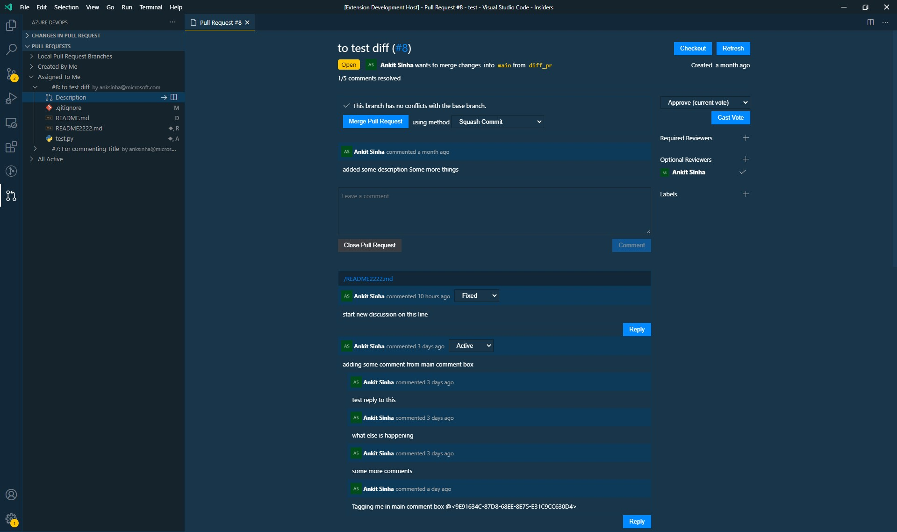

# Review and manage your Azure Devops pull requests directly in VS Code

This extension is inspired and based on [Github Pull Request Extension for VS Code](https://github.com/Microsoft/vscode-pull-request-github). The extension only works with _git_ based repository. _TFVC_ is not supported. Below are some the features that extension supports. Read about all the features in [wiki](https://github.com/ankitbko/vscode-pull-request-azdo/wiki).

- Authenticating and connecting VS Code to Azure Devops.
- Listing and browsing PRs from within VS Code.
- Reviewing PRs from within VS Code with in-editor commenting.
- Validating PRs from within VS Code with easy checkouts.
- Suggest edits to the PR Author. Author can apply edits directly from Description page.
- Mark file as viewed when reviewing PR.

You can read more about the basic features in my [blog](https://ankitbko.github.io/blog/2021/01/azdo-pr-vscode-extension/).

> **Note From Author**: I created this extension during last 2 weeks of December 2020 as a fun side project. Having never created a VS Code Extension before this was quite a journey. I am currently planning to get this to somewhat stable state before adding more features to it. Please try this extension and report any bugs by raising issue. Since this is a fork of Github PR Extension I will try to backport important updates from upstream to this extension. If you feel there has been an important bug fix or feature update in upstream that you would like in this extension, please raise an Issue here with link to the PR or Issue in upstream.

> **Disclaimer**: Although I work at Microsoft and this is a fork of Github PR Extension, this extension is not an official release or supported by Microsoft. This is a side project that I will try to maintain in my free time. Any help is always appreciated.

## Getting Started

It's easy to get started with Azure Devops Pull Requests for Visual Studio Code. Simply follow these steps to get started.

1. Make sure you have VSCode version 1.52.0 or higher.
1. Reload VS Code after the installation (click the reload button next to the extension).
1. Open your desired Azure Devops repository.
1. You will need to configure the `azdoPullRequests.projectName` and `azdoPullRequests.orgUrl` setting. You can configure it in workspace settings and commit it so others in your team wouldn't need to do this configuration again. (Look at the next section to understand the format of these settings).
1. Signin to VS Code using same Microsoft account that you use to signin to Azure Devops. Authentication will work automatically. **PAT token is no longer required**.
1. You should be good to go!

## Features

Learn all about different features of the extension in the [wiki](https://github.com/ankitbko/vscode-pull-request-azdo/wiki).

## Configuring the extension

#### azdoPullRequests.orgUrl

- _type_: string
- _required_: true
- _Description_: The organization URL of Azure Devops. You can get it from the URL of the AZDO. This is typically the first segment of URL after host name in AZDO. `https://dev.azure.com/<org_name>` or `https://<org_name>.visualstudio.com`. You will need to enter the complete URL.
- _Example_: `https://dev.azure.com/anksinha` or `https://anksinha.visualstudio.com`

#### azdoPullRequests.projectName

- _type_: string
- _required_: true
- _Description_: The project in the Azure Devops. This is typically the next segment of URL after organization name in AZDO. `https://dev.azure.com/<org_name>/<project_name>` or `https://<org_name>.visualstudio.com/<project_name>`. **Do not enter the complete URL, you only need to enter the _project_name_ part**.
- _Example_: `prExtension`

#### azdoPullRequests.logLevel

- _type_: enum
- _required_: false
- _default_: Info
- _Description_: The level of log to display in AzDO Pull Request Channel in Output window.

#### azdoPullRequests.diffBase

- _type_: enum
- _required_: false
- _default_: mergebase
- _Description_: The commit to use to get diff against the PR branch's HEAD. Read more about different options in [wiki](https://github.com/ankitbko/vscode-pull-request-azdo/wiki/Diff-Options-HEAD-vs-Merge-Base)

#### azdoPullRequests.patToken
- _type_: string
- _required_: false
- _default_: ""
- _Description_: The PAT Token from Azure DevOps, if provided extension will not prompt for Microsoft login instead it will login using provided PAT

## Known Major Issues

1. Mentions in comments are not resolved to user and no hover support
1. Can't mention users in comments
1. **Some incompatibility with Github PR Extension**. If you have both extensions installed and seeing issues with either try disabling the other extension and reloading the window.
1. In some cases, user avatar image does not show up in Dashboard.
1. Reactions do not work.

## Questions? Authentication?

See our [wiki](https://github.com/ankitbko/vscode-pull-request-azdo/wiki) for our FAQ.

## Contributing

TODO
