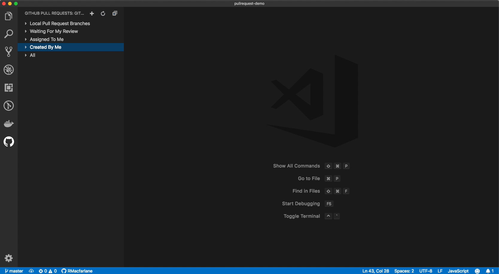
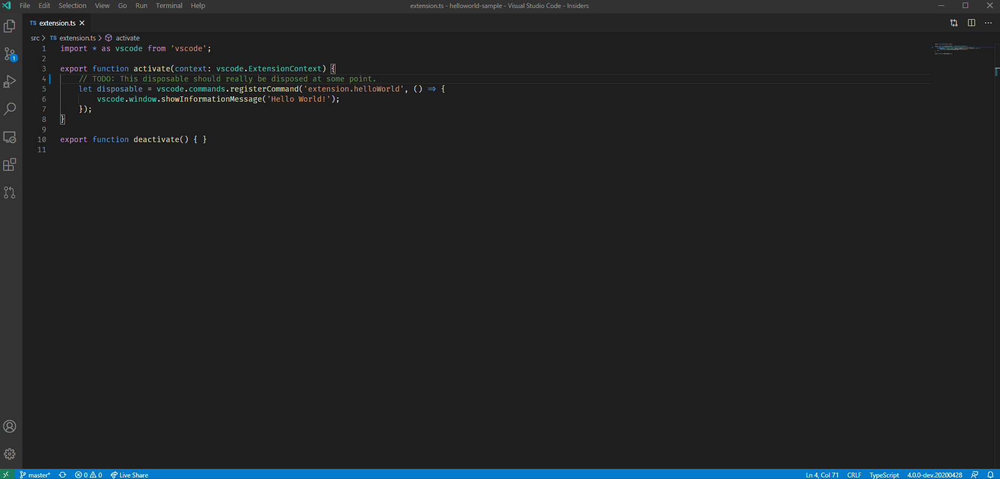

[](https://rebornix.visualstudio.com/Pull%20Request/_build/latest?definitionId=5&branchName=master)

> Review and manage your GitHub pull requests and issues directly in VS Code

This extension allows you to review and manage GitHub pull requests and issues in Visual Studio Code. The support includes:
- Authenticating and connecting VS Code to GitHub. **Note**: GitHub Enterprise is not supported
- Listing and browsing PRs from within VS Code.
- Reviewing PRs from within VS Code with in-editor commenting.
- Validating PRs from within VS Code with easy checkouts.
- Terminal integration that enables UI and CLIs to co-exist.
- Listing and browsing issues from within VS Code.
- Hover cards for "@" mentioned users and for issues.
- Completion suggestions for users and issues.
- A "Start working on issue" action which can create a branch for you.
- Code actions to create issues from "todo" comments.





# Getting Started
It's easy to get started with GitHub Pull Requests for Visual Studio Code. Simply follow these steps to get started.

1. Install the extension from within VS Code or download it from [the marketplace](https://aka.ms/vscodepr-download).
1. Open your desired GitHub repository in VS Code.
1. A new viewlet will appear on the activity bar which shows a list of pull requests and issues.
1. Use the button on the viewlet to sign in to GitHub.
1. You may need to configure the `githubPullRequests.remotes` setting, by default the extension will look for PRs for `origin` and `upstream`. If you have different remotes, add them to the remotes list.
1. You should be good to go!

# Configuring the extension
There are several settings that can be used to configure the extension.

As mentioned above, `githubPullRequests.remotes` is used to specify what remotes the extension should try to fetch pull requests from.

To customize the pull request tree, you can use the `githubPullRequests.queries` setting. This setting is a list of labels and search queries which populate the categories of the tree. By default, these queries are "Waiting For My Review", "Assigned To Me", and "Created By Me". An example of adding a "Mentioned Me" category is to change the setting to the following:

```
"githubPullRequests.queries": [
	{
		"label": "Waiting For My Review",
		"query": "is:open review-requested:${user}"
	},
	{
		"label": "Assigned To Me",
		"query": "is:open assignee:${user}"
	},
	{
		"label": "Created By Me",
		"query": "is:open author:${user}"
	},
	{
		"label": "Mentioned Me",
		"query": "is:open mentions:${user}"
	}
]
```

Similarly, there is a setting to configure your issues queries: `githubIssues.queries`.

Queries use [GitHub search syntax](https://help.github.com/en/articles/understanding-the-search-syntax).

To view additional settings for the extension, you can open VS Code settings and search for "github pull requests".

# Issues
This extension is still in development, so please refer to our [issue tracker for known issues](https://github.com/Microsoft/vscode-pull-request-github/issues), and please contribute with additional information if you encounter an issue yourself.

## Questions? Authentication? GitHub Enterprise?

See our [wiki](https://github.com/Microsoft/vscode-pull-request-github/wiki) for our FAQ.

## Contributing

[](https://lgtm.com/projects/g/Microsoft/vscode-pull-request-github/alerts/)

If you're interested in contributing, or want to explore the source code of this extension yourself, see our [contributing guide](https://github.com/Microsoft/vscode-pull-request-github/wiki/Contributing), which includes:
 - [How to Build and Run](https://github.com/Microsoft/vscode-pull-request-github/wiki/Contributing#build-and-run)
 - [Architecture](https://github.com/Microsoft/vscode-pull-request-github/wiki/Contributing#architecture)
 - [Making Pull Requests](https://github.com/Microsoft/vscode-pull-request-github/wiki/Contributing#pull-requests)
 - [Code of Conduct](https://github.com/Microsoft/vscode-pull-request-github/wiki/Contributing#code-of-conduct)
