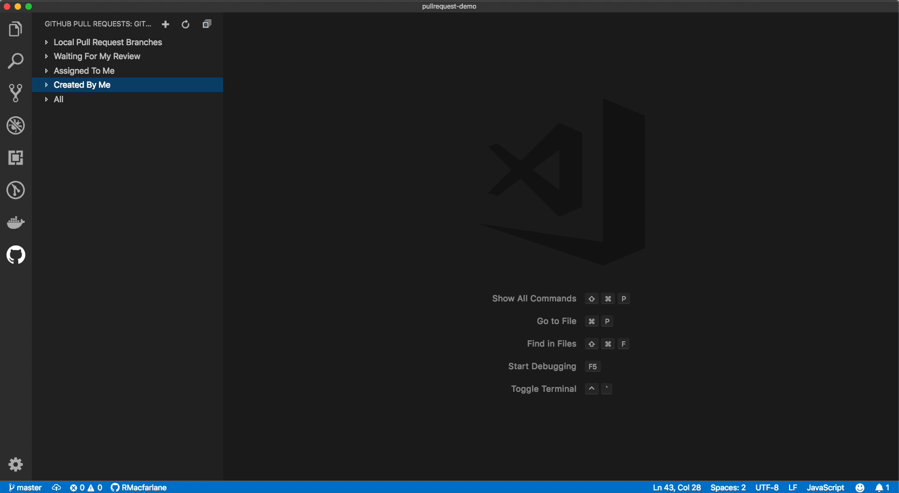
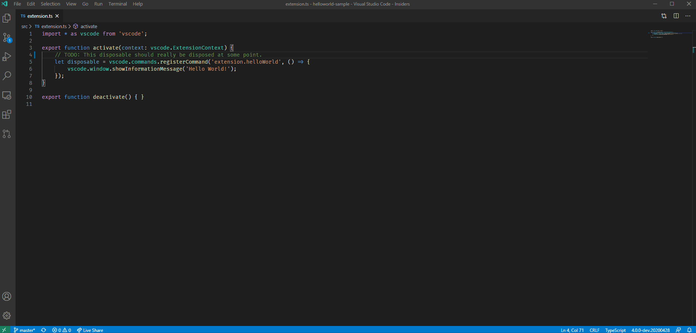

[](https://dev.azure.com/vscode/vscode-pull-request-github/_build?definitionId=44&branchName=main)

> Review and manage your GitHub pull requests and issues directly in VS Code

This extension allows you to review and manage GitHub pull requests and issues in Visual Studio Code. The support includes:

- Authenticating and connecting VS Code to GitHub and GitHub Enterprise.
- Listing and browsing PRs from within VS Code.
- Reviewing PRs from within VS Code with in-editor commenting.
- Validating PRs from within VS Code with easy checkouts.
- Terminal integration that enables UI and CLIs to co-exist.
- Listing and browsing issues from within VS Code.
- Hover cards for "@" mentioned users and for issues.
- Completion suggestions for users and issues.
- A "Start working on issue" action which can create a branch for you.
- Code actions to create issues from "todo" comments.





# Getting Started

It's easy to get started with GitHub Pull Requests for Visual Studio Code. Simply follow these steps to get started.

1. Install the extension from within VS Code or download it from [the marketplace](https://aka.ms/vscodepr-download).
1. Open your desired GitHub repository in VS Code.
1. A new viewlet will appear on the activity bar which shows a list of pull requests and issues.
1. Use the button on the viewlet to sign in to GitHub.
1. You may need to configure the `githubPullRequests.remotes` setting, by default the extension will look for PRs for `origin` and `upstream`. If you have different remotes, add them to the remotes list.
1. You should be good to go!

Check out https://www.youtube.com/watch?v=LdSwWxVzUpo for additional getting started tips!

# Configuring the extension

There are several settings that can be used to configure the extension.

## GitHub Enterprise

VS Code 1.141 or later is required. If you use Insiders, keep it updated to the latest build.

Configure GHE.com and GitHub Enterprise Server instances using the built-in GitHub Authentication setting:

```json
{
	"github-enterprise.uris": [
		"https://company.ghe.com",
		"https://github.example.com"
	]
}
```

The list order does not select a default instance. An explicitly configured list takes precedence over the deprecated `github-enterprise.uri` setting, including an empty list (`[]`), which disables Enterprise instances. If the list is not configured, the legacy setting still applies. Workspace and folder instance settings only apply in trusted workspaces.

GitHub Pull Requests uses **one selected Enterprise account at a time**, alongside a separate GitHub.com account. When another instance is needed or no account is selected, use **Select Account** in the Pull Requests or Login view. This opens account preferences for this extension and GitHub Enterprise directly, or starts sign-in if you have no Enterprise accounts yet. You can also run **GitHub Pull Requests: Select GitHub Enterprise Account...** or use **Accounts > Manage Extension Account Preferences...**. To add another instance, edit `github-enterprise.uris` in Settings; ordinary sign-in does not replace your existing list.

Removing an instance from the list does not delete its saved sign-ins. GitHub.com accounts do not need either Enterprise setting.

## Remotes and queries

As mentioned above, `githubPullRequests.remotes` is used to specify what remotes the extension should try to fetch pull requests from.

To customize the pull request tree, you can use the `githubPullRequests.queries` setting. This setting is a list of labels and search queries which populate the categories of the tree. By default, these queries are "Waiting For My Review", "Assigned To Me", and "Created By Me". An example of adding a "Mentioned Me" category is to change the setting to the following:

```
"githubPullRequests.queries": [
	{
		"label": "Waiting For My Review",
		"query": "is:open review-requested:${user}"
	},
	{
		"label": "Assigned To Me",
		"query": "is:open assignee:${user}"
	},
	{
		"label": "Created By Me",
		"query": "is:open author:${user}"
	},
	{
		"label": "Mentioned Me",
		"query": "is:open mentions:${user}"
	}
]
```

Similarly, there is a setting to configure your issues queries: `githubIssues.queries`.

Queries use [GitHub search syntax](https://help.github.com/en/articles/understanding-the-search-syntax).

To view additional settings for the extension, you can open VS Code settings and search for "github pull requests".

# Issues

This extension is still in development, so please refer to our [issue tracker for known issues](https://github.com/Microsoft/vscode-pull-request-github/issues), and please contribute with additional information if you encounter an issue yourself.

## Questions? Authentication? GitHub Enterprise?

See our [wiki](https://github.com/Microsoft/vscode-pull-request-github/wiki) for our FAQ.

## Contributing

If you're interested in contributing, or want to explore the source code of this extension yourself, see our [contributing guide](https://github.com/Microsoft/vscode-pull-request-github/wiki/Contributing), which includes:

- [How to Build and Run](https://github.com/Microsoft/vscode-pull-request-github/wiki/Contributing#build-and-run)
- [Architecture](https://github.com/Microsoft/vscode-pull-request-github/wiki/Contributing#architecture)
- [Making Pull Requests](https://github.com/Microsoft/vscode-pull-request-github/wiki/Contributing#pull-requests)
- [Code of Conduct](https://github.com/Microsoft/vscode-pull-request-github/wiki/Contributing#code-of-conduct)

### Webview Component Explorer

The webviews have browser fixtures using Component Explorer's Webpack plugin,
sharing the production webview loaders. VS Code and GitHub authentication are not
required. The explorer tools are root `devDependencies`, with versions pinned to
the `next` releases used by this integration. The CLI still depends on
Vite internally, but fixture compilation and serving use Webpack, not Vite.

With Node.js 22 or later:

```sh
npm install --no-save
npx --no-install playwright install chromium
npm run explorer:serve
```

Open <http://localhost:5338/___explorer>, or use the **Component Explorer** launch
configuration. The **Component Explorer Server** task and the workspace MCP
configuration use the same setup. `npm run explorer` starts only the Webpack
server on an available local port and prints its URL.

```sh
npm run explorer:check
npm run explorer:build
npm run explorer:render -- --workers 1
npm run explorer:render -- --workers 1 --accept
npm run explorer:render -- --workers 1 --compare --report .screenshots/report
```

Screenshots and manifests are written under `.screenshots` and are not committed.
Use the same OS, browser version, and fonts when comparing images. Fixture files
are named `*.fixture.tsx` and import the local wrapper in `webviews/fixtures`.
The gallery covers full editor and Activity Bar states, isolated headers, checks
and merge actions, comments and the comment composer, reviewers and the sidebar,
timeline entries, dropdowns, signature popovers, labels, and create-pull-request
stack and branch controls. Each fixture owns its PR context and memory-backed
host, uses deterministic time and local image assets, and disposes its React tree
and host. The local `defineComponentFixture` wrapper selects the appropriate
view's CSS. Fixtures render in the same document without per-fixture iframes.
The wrapper scopes the real webview styles with CSS `@scope`, maps viewport-width
media queries to fixture-width container queries, and provides the fixture width
to responsive React components. Theme tokens from `@vscode/webview-themes` stay
on each fixture root, including when theme variants are displayed side by side.
Each fixture also establishes a containing block and paint boundary, so fixed
headers and loading indicators cannot cover the Explorer UI or adjacent fixtures.
Set `viewportHeight` to give a fixture its own scrollable viewport; `height`
continues to set a minimum content height for full-content screenshots.
Use a current Chromium browser with CSS scope and container-query support.

Every fixture exposes a **Theme** enum input in the toolbar and properties panel.
Changing it updates the CSS theme and `isDarkTheme` together without resetting
drafts or other component state. `defaultTheme` selects the fixture's initial
theme (dark when omitted); resetting the input restores that default.
The dropdown also offers all 28 bundled themes, including VS Code high-contrast
themes and all nine GitHub Theme variants. `dark` and `light` remain aliases for
Dark Modern and Light Modern. Extension-specific color defaults are taken from
this extension's `contributes.colors`, including high-contrast color references.
The bundled catalog does not include custom overrides for these extension colors.

`@vscode/webview-themes` is pinned to the published npm version `0.0.2-0`.
No sibling theme-package checkout or local build is required.
Run `npm install --no-save` here to install the development dependencies.
The install command reads the existing lockfile without modifying it; `npm ci` requires a
separate lockfile update before it can install the new root development dependencies.

Use the local `defineThemeVariants` helper to compare the same scenario side by
side instead of adding a separate "Light" scenario:

```tsx
Ready: defineThemeVariants(defaultTheme => defineComponentFixture({
	defaultTheme,
	render: pr => <Overview {...pr} />,
})),
```

Each Dark/Light variant still accepts an explicit `{ "theme": "light" }` or
`{ "theme": "dark" }` input override. Normal screenshot captures use each
variant's default. Theme-dependent component props should read `pr.isDarkTheme`
from the render callback, not capture the fixture's default theme.

Production entry points, fixtures, and preview tests create their own context
instances and supply explicit providers. Components use React's `useContext`
with `PullRequestContext` or `PullRequestContextNew`. Both contexts require a
provider; their default value is an unused sentinel, not a shared instance.
Contexts require a `WebviewHost` for persisted state, request/reply messaging,
and incoming commands. `createWebviewHost` wraps the VS Code transport in production
and an isolated in-memory transport in fixtures. Contexts dispose only their
command subscriptions; the code that creates the host owns its disposal.
Mock unsupported commands by explicitly rejecting them rather than silently
returning success. Native VS Code context menus are outside the browser fixture's
scope.

The **Webview screenshots** GitHub Actions workflow captures screenshots for PRs
(including forks) and main, uploading them as a workflow artifact. Publication
uses [VS Code's screenshot service integration](https://github.com/microsoft/vscode/blob/d3d31f62268b169a2dfab62ffb2d7d38158a5b7c/.github/workflows/component-fixtures.yml#L243-L275):
the artifact's manifest and images are zipped at the archive root and posted to
`https://hediet-screenshots.azurewebsites.net/upload`, using a GitHub OIDC token
whose audience is `https://hediet-screenshots.azurewebsites.net`. The service
authorizes the `microsoft` organization and checks that the manifest repository
matches the token. No repository URL variable, stored secret, or per-repository
service registration is required for `microsoft/vscode-pull-request-github`.

Only main pushes, same-repository PRs, and manual runs on main publish, and only
in the upstream repository. Fork PRs and fork repositories retain artifact-only
coverage. The separate publication job has `id-token: write`; the render job
never receives that permission. Publication validates the returned commit and
fixture count, and fails visibly on authentication or upload errors.

After merging, a maintainer can verify publication with a main push or a manual
**Webview screenshots** run on main, then check the returned commit at
`https://hediet-screenshots.azurewebsites.net/commits/microsoft/vscode-pull-request-github/<commit-sha>`.
Local rendering does not validate GitHub's live OIDC exchange. If organization
Actions policy blocks `id-token: write`, a maintainer must permit it; if the
service returns 401/403, its operator must check the audience, organization
authorization, and manifest repository match. Do not add long-lived credentials
as a workaround.
