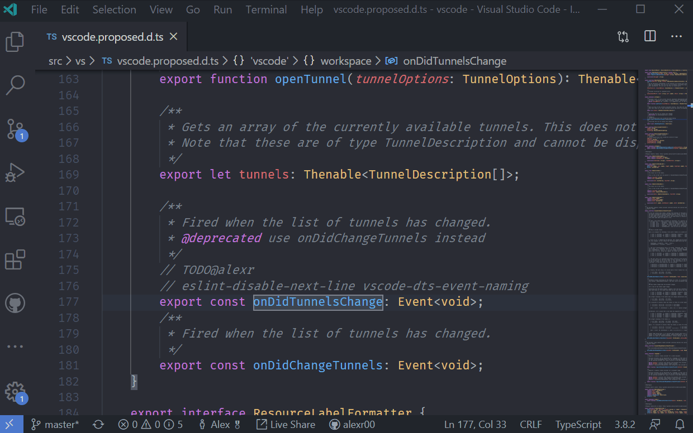
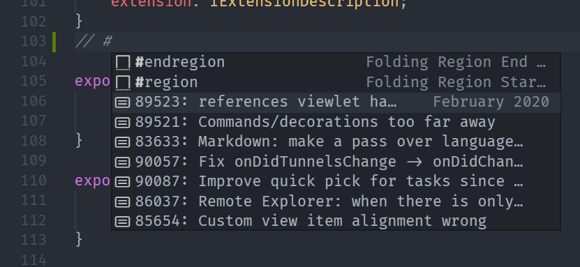
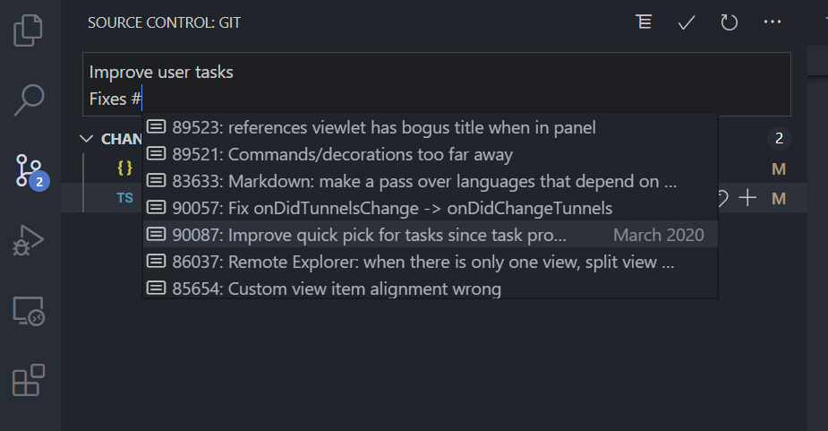
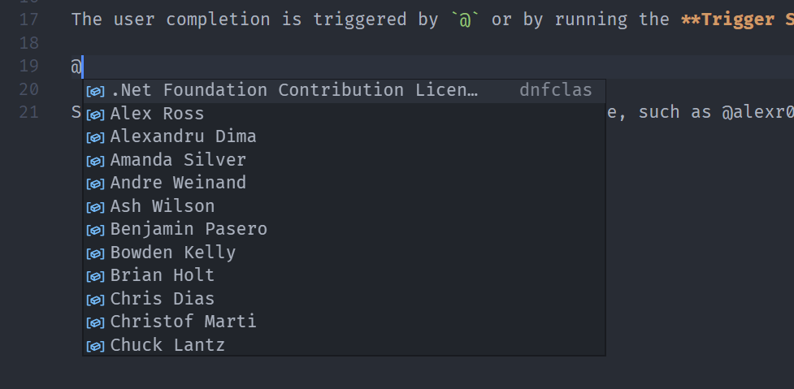
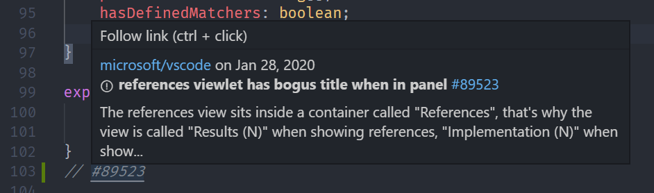
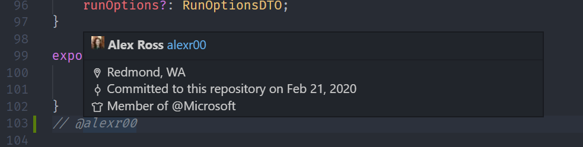

We've added some experimental GitHub issue features.

# Code actions

Wherever there is a `TODO` comment in your code, the **Create Issue from Comment** code action will show. This takes your text selection, and creates a GitHub issue with the selection as a permalink in the issue body. It also inserts the issue number after the `TODO`.

The code action trigger defaults are `TODO`, `todo`, `BUG`, `FIXME`, `ISSUE`, and `HACK`. You can modify these with the `githubIssues.createIssueTriggers` setting.
You can also create an issue from a text selection by running the **Create Issue from Selection** command.

# Commands

There are two new commands for easily creating GitHub permalinks. The **Copy GitHub Permalink** command will take the text you have selected and make a git hub permalink. The **Open Permalink in GitHub** command creates the same permalink, but also opens the link in your browser.

# Inline Completion Suggestions

## Issues

The issue completion is triggered by typing `#` or by running the **Trigger Suggest** command after a `#`. Only issues assigned to you will be in the suggestions. The initial sorting of the issues should be by milestone due date, with the "current" milestone first. If your repository doesn't use milestone due dates, then the milestone date will be guessed by the name of the milestone. Within each milestone, issues are sorted by most recently modified. If there are milestones you want to ignore, you can configure them with the `githubIssues.ignoreMilestones` setting. Issue completions work in the editor and in the Source Control commit message.

In the Source Control commit message and in most other files, the completion will insert the issue number. In markdown files, it will insert a markdown link to the issue such as `[#1234](https://github.com/Microsoft/vscode-pull-request-github/issues/1234)`

## Users

The user completion is triggered by `@` or by running the **Trigger Suggest** command after a `@`. All users that can have issues assigned to them will be suggested.

Selecting a completion item will insert the username, such as @alexr00

# Hovers

## Issues

When you hover over an issue (`#1234` or a full GitHub url) a card similar to the hover card from GitHub will show.

## Users

Similarly, there is also a hover for users such as `@alexr00`.

